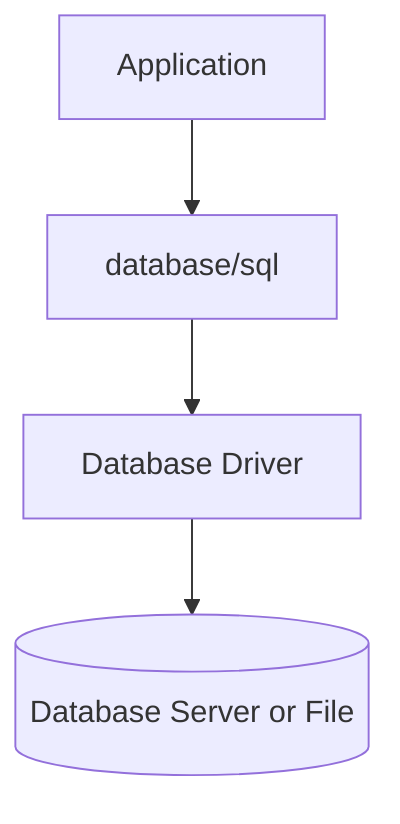

# How SQL Database Access Works

The [`database/sql`](https://pkg.go.dev/database/sql) package is Go's standard abstraction for working with SQL databases. It does not implement the network protocols used by database servers, integrate directly with embedded engines such as SQLite or translate between SQL dialects. Instead, it gives Go applications a common way to perform database operations through a suitable driver.

SQL queries remain explicit. The application constructs each query and supplies its parameters. The database executes the query, while `database/sql` coordinates the interaction between application code and the driver.

## The Role of `database/sql`

The package's main value is a consistent model for working with connections, queries, results and transactions. This model is independent of how a particular database system is accessed, so application code does not need to handle communication with a server or embedded engine itself.

For now, there is only one type to know: [`*sql.DB`](https://pkg.go.dev/database/sql#DB). It is the package's main entry point and the object that manages the connection pool. Despite its name, `*sql.DB` represents neither the database itself nor a single physical connection. The standard pattern is to create one shared `*sql.DB` instance for the application and keep it open for the entire lifetime of the process.

The package's other types are tied to specific operations: executing queries, reading results, working with transactions, prepared statements and dedicated connections. They will be introduced as needed, together with detailed explanations of their roles and lifecycles.

## Division of Responsibilities

The `database/sql` package cannot connect to a particular database system on its own. It needs a driver—a separate Go package that implements the network protocol for a database server or integrates with an embedded engine. The driver also understands the connection string format and the rules for converting values between Go and the database system.

In simplified form, the interaction looks like this:

Each layer has its own responsibilities:

| Layer | Responsibility |
| :--- | :--- |
| Application | Constructs SQL, passes arguments, defines transaction boundaries and interprets results in terms of its domain. |
| `database/sql` | Manages the connection pool, coordinates operations and delegates work to the selected driver. |
| Driver | Establishes connections, encodes queries and parameters, reads database responses and converts returned values and errors. |
| Database | Executes SQL, stores data, enforces constraints and returns results. |

When an application performs an operation, `database/sql` obtains a suitable connection from the pool and passes the query to the driver. The driver sends it to the database and converts the response into a form understood by `database/sql`. The connection can then be reused for subsequent operations.

The `database/sql` package does not parse or validate SQL queries, check whether referenced tables exist or correct syntax errors. Those responsibilities remain with the application and the database.

::: info
Driver implementations for different database systems are listed on the Go Wiki's [SQL Database Drivers](https://go.dev/wiki/SQLDrivers) page. The article [Connecting to a Database](/en/database-sql/intro/connection) covers driver registration, creating `*sql.DB`, configuring the connection string and verifying that the database is reachable.
:::

## A Common API Does Not Guarantee Portability

Whatever driver is selected, the application uses the common `*sql.DB` entry point, while `database/sql` coordinates work with the connection pool, queries, results and transactions. However, a common interface in Go code does not make different databases interchangeable or hide the differences between database systems.

| Area | What Remains Database-Specific |
| :--- | :--- |
| SQL dialect | Query syntax, parameter placeholders and supported SQL constructs. |
| Connection | DSN format, TLS configuration, authentication methods and driver-specific options. |
| Data types | How time values, JSON, arrays, UUIDs and other database values are mapped to and from Go types. |
| Errors | The codes and structures used for constraint violations, network errors and protocol errors. |
| Database behavior | Supported features, transaction semantics and concurrent access behavior. |

The `database/sql` package should therefore be treated as a common contract for interacting with SQL databases, not as a complete portability layer. When switching to another database system, the overall organization of the Go code may remain intact, but the queries, configuration, types and error handling will still need to be reviewed.
