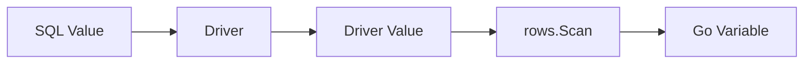

# Scanning SQL Values into Go Types

The [`Rows.Scan`](https://pkg.go.dev/database/sql#Rows.Scan) and [`Row.Scan`](https://pkg.go.dev/database/sql#Row.Scan) methods copy values from SQL query results into Go variables. For each selected column, you must pass the address of a suitable variable, and the order of the `Scan` arguments must match the order of the columns in the `SELECT` list.

This is straightforward for ordinary strings, numbers and boolean values. The main challenges arise when a column can contain `NULL`, the driver returns a value in an unexpected representation or the Go type cannot store it without losing data.

## How a Value Travels from the Database to Go

A database does not send ready-made Go types to the application. The driver reads the result in a database-specific format and provides `database/sql` with one of its supported representations, such as `int64`, `float64`, `bool`, `string`, `[]byte`, `time.Time` or `nil` for SQL `NULL`.

`Scan` then attempts to convert that value into the type of the destination variable supplied by the application:



The result therefore depends on three things:

- the type of the SQL column or expression;
- the representation selected by the driver;
- the type of the Go variable passed to `Scan`.

`database/sql` supports a number of safe conversions. For example, a textual representation of an integer can be scanned into an `int64` if it is valid and fits within the type's range. If the conversion is impossible or would overflow, `Scan` returns an error.

## Basic Type Mappings

The following Go types are commonly used as `Scan` destinations for columns with a `NOT NULL` constraint:

| SQL Value | Typical Go Type |
| :--- | :--- |
| Integer | `int64`, sometimes `int` |
| Floating-point number | `float64` |
| Boolean value | `bool` |
| Text | `string`, sometimes `[]byte` |
| Binary data | `[]byte` |
| Date and time | `time.Time` |

A simple query without nullable columns can be scanned directly into a struct:

```go
type UserRecord struct {
    ID        int64
    Email     string
    Active    bool
    CreatedAt time.Time
}

var user UserRecord

err := db.QueryRowContext(ctx, `
    SELECT id, email, active, created_at
    FROM users
    WHERE id = $1
`, userID).Scan(
    &user.ID,
    &user.Email,
    &user.Active,
    &user.CreatedAt,
)
if err != nil {
    return UserRecord{}, fmt.Errorf("scan user: %w", err)
}
```

This code is correct as long as all four columns return values compatible with the selected Go types. If `email` can be `NULL`, for example, it needs a different destination type.

::: warning
Do not use `float64` for monetary values simply because `Scan` can read numbers into it. Binary floating-point representation can lose decimal precision. The appropriate representation for `DECIMAL` or `NUMERIC` depends on the application's requirements and the driver's capabilities.
:::

## Representing `NULL` in Go

SQL `NULL` represents the absence of a value. This is different from a Go zero value.

If a nullable column is scanned into an ordinary `string`, `int64`, `bool` or `time.Time`, `Scan` returns an error when the value is `NULL`:

```go
var displayName string

err := db.QueryRowContext(ctx, `
    SELECT display_name
    FROM users
    WHERE id = $1
`, userID).Scan(&displayName)
```

This code works while `display_name` contains a string, but fails when the database returns `NULL`.

`NULL` can appear even when the underlying column has a `NOT NULL` constraint. For example, the right side of a `LEFT JOIN` produces `NULL` when no matching row exists, and some aggregate functions return `NULL` for an empty set.

There are three common ways to handle a missing value:

1. Use one of the `sql.Null*` types or the generic `sql.Null[T]` type.
2. Scan into a pointer such as `*string` or `*time.Time`.
3. Convert `NULL` in SQL with `COALESCE` when losing the distinction is acceptable for the application.

Here is an example with `COALESCE`:

```go
var displayName string

err := db.QueryRowContext(ctx, `
    SELECT COALESCE(display_name, '')
    FROM users
    WHERE id = $1
`, userID).Scan(&displayName)
if err != nil {
    return fmt.Errorf("scan display name: %w", err)
}
```

The `NULL` is now converted to an empty string before `Scan` is called.

Use `COALESCE` only when `NULL` and the zero value genuinely mean the same thing to the application. After this conversion, there is no way to distinguish between "the value was absent" and "the database contained an empty string."

### The `sql.Null*` Types

The package provides ready-made structs for common nullable values:

| Type | Value Field |
| :--- | :--- |
| [`sql.NullString`](https://pkg.go.dev/database/sql#NullString) | `String string` |
| [`sql.NullInt64`](https://pkg.go.dev/database/sql#NullInt64) | `Int64 int64` |
| [`sql.NullBool`](https://pkg.go.dev/database/sql#NullBool) | `Bool bool` |
| [`sql.NullFloat64`](https://pkg.go.dev/database/sql#NullFloat64) | `Float64 float64` |
| [`sql.NullTime`](https://pkg.go.dev/database/sql#NullTime) | `Time time.Time` |

`Valid` is `true` when the database returned a non-`NULL` value. The value itself is stored in the type-specific field, such as `String`, `Int64`, `Bool`, `Float64` or `Time`.

```go
type NullableUserRow struct {
    ID          int64
    DisplayName sql.NullString
    ManagerID   sql.NullInt64
    DeletedAt   sql.NullTime
}

var user NullableUserRow

err := db.QueryRowContext(ctx, `
    SELECT id, display_name, manager_id, deleted_at
    FROM users
    WHERE id = $1
`, userID).Scan(
    &user.ID,
    &user.DisplayName,
    &user.ManagerID,
    &user.DeletedAt,
)
if err != nil {
    return NullableUserRow{}, fmt.Errorf("scan user: %w", err)
}
```

After scanning, use `Valid` to distinguish between a value and `NULL`:

```go
if user.DisplayName.Valid {
    fmt.Println(user.DisplayName.String)
} else {
    fmt.Println("display name is not set")
}
```

Always check `Valid` before using the value field. If the database returned `NULL`, the corresponding `String`, `Int64` or `Time` field contains the ordinary zero value for its Go type.

### The Generic `sql.Null[T]` Type

As of Go 1.22, the package also provides [`sql.Null[T]`](https://pkg.go.dev/database/sql#Null). It stores the value in `V` and records its presence in `Valid`:

```go
var (
    displayName sql.Null[string]
    managerID   sql.Null[int64]
    deletedAt   sql.Null[time.Time]
)

err := row.Scan(&displayName, &managerID, &deletedAt)
if err != nil {
    return fmt.Errorf("scan user details: %w", err)
}

if displayName.Valid {
    fmt.Println(displayName.V)
}
```

The generic type provides one form for different kinds of values. The traditional `sql.NullString`, `sql.NullInt64` and `sql.NullTime` types are still common and can make the expected type clearer in the name itself.

The type `T` must be supported as a driver value. `sql.Null[T]` does not make an arbitrary Go struct automatically compatible with a database column. Types that manage their own reading and writing are covered in the next article, [Custom Data Types](/en/database-sql/queries/custom-data-types).

### Pointers for Nullable Values

Pointers can be used instead of `sql.Null*` and `sql.Null[T]`. When scanning `NULL`, the pointer is set to `nil`. For a non-`NULL` value, `Scan` allocates memory and stores the value at that address.

```go
type UserWithNullableFields struct {
    ID          int64
    DisplayName *string
    ManagerID   *int64
    DeletedAt   *time.Time
}

var user UserWithNullableFields

err := db.QueryRowContext(ctx, `
    SELECT id, display_name, manager_id, deleted_at
    FROM users
    WHERE id = $1
`, userID).Scan(
    &user.ID,
    &user.DisplayName,
    &user.ManagerID,
    &user.DeletedAt,
)
if err != nil {
    return UserWithNullableFields{}, fmt.Errorf("scan user: %w", err)
}
```

`Scan` receives the address of the pointer field, so `&user.DisplayName` has the type `**string`. This lets the method change the pointer itself: it can set the pointer to `nil` for `NULL` or create a `*string` for a regular value.

The check is familiar Go code:

```go
if user.DisplayName != nil {
    fmt.Println(*user.DisplayName)
}
```

Each approach has its own trade-offs. There is no universal choice; using one approach consistently is more important.

## Binary Data and `[]byte`

Binary columns are usually scanned into `[]byte`:

```go
var payload []byte

err := db.QueryRowContext(ctx, `
    SELECT payload
    FROM audit_events
    WHERE id = $1
`, eventID).Scan(&payload)
if err != nil {
    return nil, fmt.Errorf("scan event payload: %w", err)
}
```

When scanning into `[]byte`, the package makes a copy of the data that belongs to the caller. The slice can be retained and modified after moving to the next row.

Some drivers also represent text columns as `[]byte`. `Scan` can usually convert such a value to `string`, but the driver's implementation still determines the original representation.

::: info
The [`sql.RawBytes`](https://pkg.go.dev/database/sql#RawBytes) type can avoid a copy when reading from `*sql.Rows`, but its data is valid only until the next call to `Next`, `Scan` or `Close`. `RawBytes` cannot be used with `Row.Scan`. For ordinary application code, `[]byte` is the safer choice; use `RawBytes` only when you have deliberately accounted for its restricted lifetime.
:::

For nullable binary data, decide whether `NULL` and an empty slice need to remain distinct. If the distinction matters, you can use `sql.Null[[]byte]`.

## Dates, Times and Time Zones

Dates and times are commonly scanned into [`time.Time`](https://pkg.go.dev/time#Time), while nullable columns use [`sql.NullTime`](https://pkg.go.dev/database/sql#NullTime) or `*time.Time`:

```go
var createdAt time.Time

err := db.QueryRowContext(ctx, `
    SELECT created_at
    FROM users
    WHERE id = $1
`, userID).Scan(&createdAt)
if err != nil {
    return fmt.Errorf("scan created_at: %w", err)
}
```

`database/sql` does not define the semantics of a temporal column or select a time zone for it. `Scan` only copies the value it receives into `time.Time`, preserving its `Location`. The package cannot determine whether the column represents an unambiguous instant, a local date and time or a calendar date alone.

If the value represents an instant, it can be represented in UTC after scanning:

```go
createdAt = createdAt.UTC()
```

The [`UTC`](https://pkg.go.dev/time#Time.UTC) and [`In`](https://pkg.go.dev/time#Time.In) methods change the representation of a known instant, not the instant itself. They do not attach a time zone to a calendar value or recover time-zone information that has already been lost.

Direct scanning into `time.Time` is possible only when the source value is compatible with that type. `Scan` does not parse arbitrary strings or `[]byte` values containing dates; such a value must first be read as text and parsed separately.

In other words, `database/sql` is responsible for transferring a value into a Go variable, while the semantics of the column, its format and its time zone remain part of the database schema and application design.
