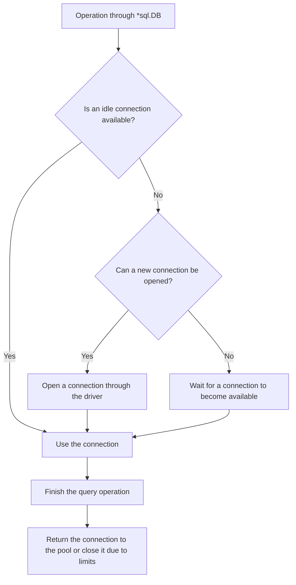

# Connection Pool

[`*sql.DB`](https://pkg.go.dev/database/sql#DB) is not a single connection. It is a handle that manages a connection pool and is safe for concurrent use. When multiple goroutines execute queries at the same time, `database/sql` assigns them idle connections, opens new ones as needed and returns connections to the pool when the work is complete.

The pool allows established connections to be reused and limits the load placed on the database. Its settings must account for the number of application instances, the database server's connection limit and the actual concurrency of database operations. A pool that is too small creates a queue inside the application, while one that is too large can overload the database.

## How the Pool Works

The pool opens connections on demand. Calling `sql.Open` does not normally establish any connections in advance. The first physical connection may be opened by `PingContext`, `ExecContext`, `QueryContext` or another operation that actually needs database access.

For each operation, `database/sql` follows this simplified path:



A connection is not always returned to the pool immediately after the database sends its response. It may remain occupied by:

- an open [`*sql.Rows`](https://pkg.go.dev/database/sql#Rows), until all rows have been read or `Close` is called;
- an unfinished [`*sql.Tx`](https://pkg.go.dev/database/sql#Tx), until `Commit` or `Rollback`;
- a dedicated [`*sql.Conn`](/en/database-sql/connections/dedicated-connection), until `Conn.Close`.

::: warning
Create one `*sql.DB` for each distinct connection configuration and reuse it for successive queries. If every HTTP handler or data access component creates its own `*sql.DB`, the application ends up with several independent pools and loses centralized control over the total number of connections.
:::

## Open Connection Limit (`SetMaxOpenConns`)

The [`db.SetMaxOpenConns`](https://pkg.go.dev/database/sql#DB.SetMaxOpenConns) method limits the total number of open connections. The limit includes both in-use and idle connections:

```go
db.SetMaxOpenConns(maxOpenConns)
```

A value of `n <= 0` removes the limit. The default is `0`, which means there is no limit.

## Idle Connection Limit (`SetMaxIdleConns`)

The [`db.SetMaxIdleConns`](https://pkg.go.dev/database/sql#DB.SetMaxIdleConns) method sets the maximum number of idle connections that the pool retains for future operations:

```go
db.SetMaxIdleConns(maxIdleConns)
```

An idle connection has already been established but is not currently serving a database operation. Reusing it is usually less expensive than opening a new connection, which may require network setup, authentication and session initialization.

If `n <= 0`, the pool retains no idle connections. The current Go documentation lists the default as `2`, but explicitly warns that this value may change. Set the limit explicitly when the behavior matters to the application.

In practice, `MaxIdleConns` cannot exceed a positive `MaxOpenConns` limit. If a larger value is configured, `database/sql` reduces the idle connection limit to match the overall open connection limit.

## Maximum Connection Lifetime (`SetConnMaxLifetime`)

The [`db.SetConnMaxLifetime`](https://pkg.go.dev/database/sql#DB.SetConnMaxLifetime) method limits a connection's total age from the time it was created:

```go
db.SetConnMaxLifetime(connMaxLifetime)
```

Once an expired connection becomes available to the pool, it is closed instead of being reused for another operation. This may happen later than the exact moment the limit is reached—for example, when the connection returns to the pool or is checked before reuse.

A value of `d <= 0` disables age-based closing. An excessively short lifetime causes constant reconnections and increases the load on the driver, network and database.

::: info
`SetConnMaxLifetime` is not a SQL query timeout. It does not interrupt an operation already in progress solely because the connection has reached its maximum age. Use a context to limit query execution time.
:::

## Maximum Idle Time (`SetConnMaxIdleTime`)

The [`db.SetConnMaxIdleTime`](https://pkg.go.dev/database/sql#DB.SetConnMaxIdleTime) method limits the continuous amount of time that a connection may remain unused:

```go
db.SetConnMaxIdleTime(connMaxIdleTime)
```

A value of `d <= 0` disables idle-time-based closing. As with `SetConnMaxLifetime`, expired connections may be closed later rather than at the exact moment the limit is reached.

`ConnMaxLifetime` and `ConnMaxIdleTime` answer different questions:

| Setting | What It Measures | When the Connection Becomes a Candidate for Closing |
| :--- | :--- | :--- |
| `ConnMaxLifetime` | The connection's total age | Its age exceeds the limit, even if the connection has been used regularly. |
| `ConnMaxIdleTime` | Continuous time without use | The connection has remained idle for too long. |

These settings are often used together: `ConnMaxLifetime` retires old connections regardless of activity, while `ConnMaxIdleTime` releases excess idle connections after the load decreases.

## Choosing Initial Settings

Start by defining a safe upper budget rather than trying to find an "ideal pool size." Subtract a reserve for administration and migrations, as well as connections used by other applications, from the database server's limit. Then divide the budget assigned to the service by the maximum number of instances that can run simultaneously:

```text
serviceBudget = databaseLimit - reserve - otherConsumers
perInstanceCeiling = serviceBudget / maxSimultaneousInstances
```

Use the upper autoscaling limit rather than the current number of instances. If one process creates multiple `*sql.DB` values, the sum of their `MaxOpenConns` limits must remain within the calculated per-instance ceiling. For example, with a service budget of 80 connections and a maximum of 4 instances, each instance can use no more than 20 connections in total.

`MaxOpenConns` is a ceiling, not a target number of connections to keep open. Start with a smaller value that reflects the expected number of concurrent database operations, then test it under realistic load. A useful starting heuristic for `MaxIdleConns` is the smaller of `MaxOpenConns` and the usual—not peak—number of concurrent operations. An idle limit that is too small causes frequent reconnections, while an unnecessarily large one consumes the database's connection budget.

Do not assign arbitrary "standard" values to `ConnMaxLifetime` and `ConnMaxIdleTime`. If a proxy, load balancer or database server enforces a maximum connection age, set `ConnMaxLifetime` slightly below that limit. Choose `ConnMaxIdleTime` relative to an external idle timeout or the desired time for releasing excess connections. If no such requirements exist, both limits may remain disabled. After configuring them, check that the selected values do not cause frequent bursts of reconnections.

::: warning
This calculation establishes only a safe upper bound. It does not prove that the database can handle that many concurrent queries. Confirm the final limit with load tests and metrics from the database server itself.
:::

## Pool State and Statistics (`DB.Stats`)

The [`db.Stats`](https://pkg.go.dev/database/sql#DB.Stats) method returns a snapshot of [`sql.DBStats`](https://pkg.go.dev/database/sql#DBStats). It does not query the database and describes the state of the pool inside the current Go process.

```go
stats := db.Stats()

slog.Info("database pool",
    "max_open", stats.MaxOpenConnections,
    "open", stats.OpenConnections,
    "in_use", stats.InUse,
    "idle", stats.Idle,
    "wait_count", stats.WaitCount,
    "wait_duration", stats.WaitDuration,
    "max_idle_closed", stats.MaxIdleClosed,
    "max_idle_time_closed", stats.MaxIdleTimeClosed,
    "max_lifetime_closed", stats.MaxLifetimeClosed,
)
```

The fields are divided into current state and cumulative counters:

| Field | Meaning |
| :--- | :--- |
| `MaxOpenConnections` | The current open connection limit. Zero means unlimited. |
| `OpenConnections` | All established connections, both in use and idle. |
| `InUse` | Connections currently held by queries, transactions, `Rows` or `Conn`. |
| `Idle` | Idle connections that are ready for reuse. |
| `WaitCount` | The total number of times operations have had to wait for a connection. |
| `WaitDuration` | The total time operations have spent waiting for connections. |
| `MaxIdleClosed` | The total number of connections closed because of `MaxIdleConns`. |
| `MaxIdleTimeClosed` | The total number of connections closed because of `ConnMaxIdleTime`. |
| `MaxLifetimeClosed` | The total number of connections closed because of `ConnMaxLifetime`. |

For a single snapshot, the following relationship holds:

```text
OpenConnections = InUse + Idle
```

`WaitCount`, `WaitDuration` and the connection-closure counters accumulate over the lifetime of `*sql.DB`. For monitoring, changes in these values over a time interval are more useful than comparing their absolute values with a fixed threshold.

## Diagnosing Pool Behavior with `DB.Stats`

A single snapshot rarely explains a problem. Export `DB.Stats` regularly as metrics, compare values over equal time intervals and consider them together with query latency, errors and load on the database server:

| Observation | What to Check |
| :--- | :--- |
| `WaitCount` and `WaitDuration` are increasing while `InUse` is close to a positive `MaxOpenConnections` limit | Operations are queued waiting for the pool. First look for slow queries and unreleased `Rows`, `Tx` or `Conn` values; then check whether the database has enough capacity for a higher limit. |
| Latency is increasing, but the wait counters remain unchanged and `InUse` is below the limit | Connection acquisition is probably not the bottleneck. Check the SQL, locks, network and database server. |
| `MaxIdleClosed` is increasing rapidly alongside frequent new connections | `MaxIdleConns` may be too low for the usual workload. |
| `MaxIdleTimeClosed` or `MaxLifetimeClosed` is increasing rapidly and frequent reconnections are visible | The corresponding intervals may be too short. Growth in these counters is expected when the limits are configured. |
| `InUse` remains high long after the load decreases | Look for long-running operations, unread `Rows`, unfinished transactions and retained `Conn` values. |

Tune the pool iteratively: record baseline metrics, change one setting, repeat the same workload and check the effect on both the application and the database server. Increase `MaxOpenConns` only within the calculated connection budget.
