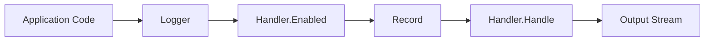
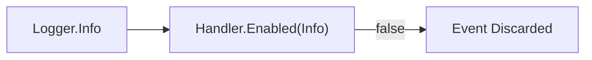

# Logging Flow

Calling `logger.Info` does not format its arguments into a string immediately. Instead, the logger first checks whether the specified severity level is enabled, constructs an event record, and passes it to the log handler.

```go
logger.Info("request completed",
    "method", "GET",
    "route", "/users/{id}",
    "status", 200,
)
```

From the perspective of application code, this is a single method call. Internally, `log/slog` processes the event through several distinct stages. Understanding this execution flow clarifies where level filtering occurs, how operational metadata is captured, and which component controls text or JSON formatting.

## The Event Lifecycle

The overall execution pipeline is as follows:



If `Handler.Enabled` returns `false`, execution terminates early before creating a `Record`. If the level is enabled, the logger builds the event record and passes it to `Handler.Handle`. The handler then formats the record and writes it to the designated output stream or downstream system.

## The Role of `Logger`

The [`slog.Logger`](https://pkg.go.dev/log/slog#Logger) type serves as the primary entry point for application code. Methods like `Info` accept an event message and variadic key-value attributes, assign the appropriate severity level (`slog.LevelInfo`), and interact with the attached handler.

`Logger` is agnostic to output formats—it does not care whether the event becomes plain text, JSON, or an entry in a remote telemetry system. Its job is to capture common event metadata: level, timestamp, message, source code call site position, and attributes. Rendering these fields into a specific format is delegated entirely to the handler.

Each `*slog.Logger` is associated with a single `slog.Handler` provided to [`slog.New`](https://pkg.go.dev/log/slog#New). You can access the handler via [`Logger.Handler`](https://pkg.go.dev/log/slog#Logger.Handler), though application components rarely interact with the handler directly.

## Early Filtering via `Handler.Enabled`

Before building a complete event record, the logger invokes the `Enabled` method of the [`slog.Handler`](https://pkg.go.dev/log/slog#Handler) interface. The handler inspects the event's severity level (and optional context) to decide whether processing should proceed.

If the handler's minimum threshold is set to `Warn`, calling `logger.Info` stops at this check:



By evaluating `Enabled` upfront, `slog` avoids unnecessary memory allocations: it skips `Record` allocation, attribute conversion, and string formatting entirely for disabled log levels.

## Anatomy of a `Record`

When an event level is enabled, the logger constructs an [`slog.Record`](https://pkg.go.dev/log/slog#Record). This structure serves as an internal, format-agnostic container for a single log event.

| Field / Feature | Content |
| :--- | :--- |
| `Time` | The timestamp when the logger method was called |
| `Level` | The severity level (`Debug`, `Info`, `Warn`, `Error`, or custom) |
| `Message` | The event message string (e.g., `"request completed"`) |
| `PC` | Program counter representing the source code call site position |
| Attributes | Named key-value pairs (`method`, `route`, `status`, etc.) |

The `PC` (program counter) field captures runtime frame information, allowing handlers to report the exact file name and line number where the log call occurred. When source location logging is enabled, built-in handlers resolve this `PC` automatically without requiring manual file name parameters in log messages.

Attributes are stored within `Record` as format-agnostic values. The handler receives them alongside the record header and determines how to format each key-value pair.

Application code rarely creates or manipulates `slog.Record` directly. Components emit events via `Logger`, while custom handlers, wrappers, and middleware process the underlying `Record`.

## Processing via `Handler.Handle`

Once the `Record` is constructed, the logger invokes `Handler.Handle(ctx, record)`. The handler receives the complete record and performs final formatting and delivery.

For built-in `TextHandler`, this means serializing record fields into a `key=value` string:

```text
time=2026-07-22T10:15:42.123+02:00 level=INFO msg="request completed" method=GET route=/users/{id} status=200
```

For `JSONHandler`, the same `Record` is rendered as a JSON object:

```json
{"time":"2026-07-22T10:15:42.123+02:00","level":"INFO","msg":"request completed","method":"GET","route":"/users/{id}","status":200}
```

Swapping the handler changes only this final step of the pipeline; the application call `logger.Info(...)` and the structure of the `Record` remain untouched.

A handler is not limited to writing text to stdout. Custom handlers can forward records to other handlers, inject global fields, or transmit telemetry asynchronously to external services—all using the same `Enabled` and `Handle` contract.

::: info
`Handler.Handle` returns an `error`, but `Logger` convenience methods (`Info`, `Warn`, `Error`, etc.) ignore it. The logger silently drops any error returned by `Handle`. If your system requires tracking handler delivery failures, error handling logic must be implemented inside the custom handler or handler wrapper itself.
:::

## Component Responsibilities

Tracing the event lifecycle establishes clear separation of concerns across `log/slog`:

| Component | Responsibility |
| :--- | :--- |
| Application Code | Selects the event message, level, and contextual attributes |
| `Logger` | Receives calls, checks `Enabled`, and constructs `Record` |
| `Record` | Holds event data in a format-agnostic container |
| `Handler` | Filters events, formats output, and delivers records |

This decoupled design applies equally to simple local text logging and complex production telemetry pipelines. Application components communicate events through `Logger`, while filtering, formatting, and output routing remain fully encapsulated behind the `Handler` interface.
