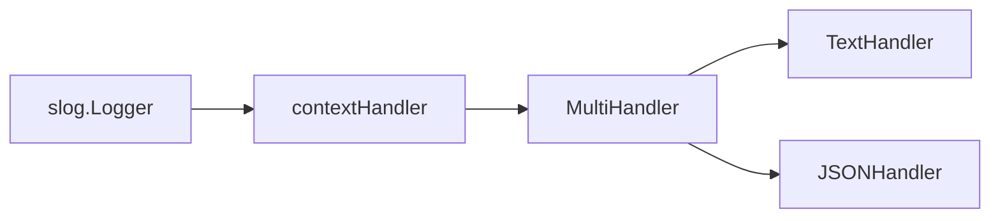

# Wrappers and Handler Composition

Extending logging functionality does not always require building a completely custom handler from scratch. Often, a lightweight handler wrapper is sufficient: it performs a single targeted transformation on an [`slog.Record`](https://pkg.go.dev/log/slog#Record) before delegating the record to a standard [`slog.TextHandler`](https://pkg.go.dev/log/slog#TextHandler), [`slog.JSONHandler`](https://pkg.go.dev/log/slog#JSONHandler), or other underlying handler.

Multiple handlers can be composed in layered pipelines. For example, an outer wrapper layer might extract `request_id` from context, a fan-out layer duplicates events across multiple destinations, and built-in handlers render text and JSON output:



The order of handler layers directly shapes runtime behavior: an outer wrapper applied *before* a fan-out layer enriches all downstream event copies, whereas a wrapper applied to a single child branch affects only that specific output stream.

## Building a Safe Handler Wrapper

A handler wrapper holds a reference to a downstream handler and delegates core execution to it. To function reliably, a wrapper must explicitly implement all four methods of the [`slog.Handler`](https://pkg.go.dev/log/slog#Handler) interface rather than relying on naive struct embedding.

Naively embedding `slog.Handler` introduces a common bug:

```go
type brokenHandler struct {
    slog.Handler
}

func (h *brokenHandler) Handle(
    ctx context.Context,
    record slog.Record,
) error {
    // Custom processing...
    return h.Handler.Handle(ctx, record)
}
```

While log calls on the initial logger instance invoke the overridden `Handle` method as expected, calling `logger.With` delegates `WithAttrs` to the embedded handler directly. That embedded handler returns a derived inner handler, stripping `brokenHandler` from the wrapper chain and silently disabling your custom wrapper behavior.

A robust handler wrapper explicitly delegates `Enabled`, and re-wraps the results of `WithAttrs` and `WithGroup` in the wrapper type.

## Extracting Attributes from `context.Context`

When application layers use `InfoContext`, `ErrorContext`, or other context-aware log methods, a handler wrapper can centrally extract request metadata (such as a `request_id`) from `context.Context` and append it as a log attribute.

First, define a unexported context key type and accessor helpers:

```go
type requestIDKey struct{}

func withRequestID(
    ctx context.Context,
    requestID string,
) context.Context {
    return context.WithValue(
        ctx,
        requestIDKey{},
        requestID,
    )
}

func requestIDFromContext(ctx context.Context) (string, bool) {
    requestID, ok := ctx.Value(requestIDKey{}).(string)
    return requestID, ok
}
```

Next, define the wrapper struct holding the downstream handler:

```go
type contextHandler struct {
    next slog.Handler
}

func NewContextHandler(next slog.Handler) slog.Handler {
    if next == nil {
        panic("nil handler")
    }

    return &contextHandler{next: next}
}
```

The constructor accepts any `slog.Handler`. Validating against `nil` up front catches configuration errors immediately during startup rather than panicking on the first log call.

### Implementing `Enabled` and `Handle`

The level check delegates directly to the downstream handler:

```go
func (h *contextHandler) Enabled(
    ctx context.Context,
    level slog.Level,
) bool {
    return h.next.Enabled(ctx, level)
}
```

`Handle` extracts the request ID from context and appends it to the record only if a non-empty value is present:

```go
func (h *contextHandler) Handle(
    ctx context.Context,
    record slog.Record,
) error {
    requestID, ok := requestIDFromContext(ctx)
    if !ok || requestID == "" {
        return h.next.Handle(ctx, record)
    }

    record = record.Clone()
    record.AddAttrs(
        slog.String("request_id", requestID),
    )

    return h.next.Handle(ctx, record)
}
```

Before modifying the record, invoke [`Record.Clone`](https://pkg.go.dev/log/slog#Record.Clone). Shallow copies of an `slog.Record` share internal attribute storage with the original record; cloning guarantees thread safety. If no request ID is present in context, the wrapper delegates directly without allocating a clone.

Context cancellation or deadlines do not block log processing. `Handle` inspects `ctx` solely to read request values, then forwards the context to downstream handlers.

### Implementing `WithAttrs` and `WithGroup`

To preserve wrapping when `With` or `WithGroup` is invoked, wrap the downstream derived handlers:

```go
func (h *contextHandler) WithAttrs(
    attrs []slog.Attr,
) slog.Handler {
    return &contextHandler{
        next: h.next.WithAttrs(attrs),
    }
}

func (h *contextHandler) WithGroup(
    name string,
) slog.Handler {
    if name == "" {
        return h
    }

    return &contextHandler{
        next: h.next.WithGroup(name),
    }
}
```

The parent wrapper instance remains immutable, allowing base and derived loggers to be used concurrently without side effects. Namespace and group semantics are managed by the downstream handler: `TextHandler` formats dot-separated keys, while `JSONHandler` constructs nested objects.

Connect the wrapper during logger initialization:

```go
handler := NewContextHandler(
    slog.NewJSONHandler(os.Stdout, nil),
)
logger := slog.New(handler)

ctx := withRequestID(
    context.Background(),
    "req-7",
)

logger.InfoContext(ctx, "request completed",
    slog.Int("status", http.StatusOK),
)
```

The extracted `request_id` appears as a standard structured attribute in the output:

```json
{"time":"2026-07-22T12:00:00Z","level":"INFO","msg":"request completed","status":200,"request_id":"req-7"}
```

Standard `logger.Info` calls pass `context.Background()`, so the wrapper will find no request ID. Automatic context enrichment applies only when callers pass an active `ctx` to `*Context` log methods.

::: warning
Avoid adding `request_id` simultaneously via both this context wrapper and `logger.With`: doing so produces duplicate key names in log records. Choose one consistent enrichment strategy for a given logger pipeline.
:::

## Impact of Open Groups

Attributes appended to `slog.Record` before invoking the downstream handler are subject to any open groups created via `WithGroup`. For example:

```go
workerLogger := logger.WithGroup("worker")

workerLogger.InfoContext(ctx, "job completed",
    slog.Int64("job_id", jobID),
)
```

`JSONHandler` places both `job_id` and the context-injected `request_id` inside the `worker` group:

```json
{"time":"2026-07-22T12:00:00Z","level":"INFO","msg":"job completed","worker":{"job_id":42,"request_id":"req-7"}}
```

This behavior aligns with `WithGroup` specifications. However, if your schema requires `request_id` to remain strictly at the root level of every JSON log record, construct event groups inline using call-site attributes instead of `WithGroup`:

```go
logger.InfoContext(ctx, "job completed",
    slog.Group("worker",
        slog.Int64("job_id", jobID),
    ),
)
```

Now `request_id` remains top-level, while `job_id` is scoped under `worker`. Forcing attributes to root level while supporting `WithGroup` requires a more complex wrapper that tracks and reapplies open group hierarchies manually.

## Multi-Handler Fan-Out Composition

::: info Go 1.26+
The [`slog.NewMultiHandler`](https://pkg.go.dev/log/slog#NewMultiHandler) function was introduced in [Go 1.26](https://go.dev/doc/go1.26#log/slog). In earlier Go versions, custom multi-handler dispatching requires a custom handler implementation.
:::

`MultiHandler` duplicates log events across multiple child handlers. For instance, you can output human-readable text to stdout for routine logs while simultaneously piping `Error` events to a JSON file:

```go
func newLogger(
    consoleOut io.Writer,
    errorOut io.Writer,
) *slog.Logger {
    consoleHandler := slog.NewTextHandler(
        consoleOut,
        &slog.HandlerOptions{
            Level: slog.LevelInfo,
        },
    )

    errorHandler := slog.NewJSONHandler(
        errorOut,
        &slog.HandlerOptions{
            Level: slog.LevelError,
        },
    )

    handler := NewContextHandler(
        slog.NewMultiHandler(
            consoleHandler,
            errorHandler,
        ),
    )

    return slog.New(handler)
}
```

An `Info` event is handled solely by `consoleHandler`, whereas an `Error` event is dispatched to both handlers. `MultiHandler.Enabled` returns `true` if the event level is enabled by at least one child handler. During `Handle`, each child checks its own level threshold independently.

Before dispatching to each enabled child, `MultiHandler` clones the `Record`, ensuring mutations made by one handler do not affect others. Errors returned by child `Handle` calls are combined, though standard `slog.Logger` methods drop handler errors as usual.

Child handlers are invoked synchronously in the order passed to `NewMultiHandler`. A slow child handler will block the logger pipeline; `MultiHandler` does not spawn background goroutines or provide internal buffering queues.

`WithAttrs` and `WithGroup` propagate across all child handlers, preserving identical bound attributes and namespaces across all output streams.

For Go versions prior to 1.26, fan-out dispatching requires a custom `slog.Handler` implementation that enforces equivalent guarantees: unified `Enabled` checks, individual child level filtering, `Record.Clone` isolation, `WithAttrs`/`WithGroup` propagation, and error aggregation.

## Layer Composition Order

In the previous example, `contextHandler` wraps `MultiHandler`:

```go
NewContextHandler(
    slog.NewMultiHandler(consoleHandler, errorHandler),
)
```

The request ID is extracted once, and both downstream handlers receive the enriched record. Reversing the wrapping order changes the outcome:

```go
slog.NewMultiHandler(
    consoleHandler,
    NewContextHandler(errorHandler),
)
```

Now `request_id` is appended only to error JSON logs. While such composition may occasionally be intentional, layer ordering should always be designed purposefully to fit your data schema.

The same principle applies to other wrapper types: outer filters halt execution for the entire pipeline, branch-specific transformers affect only their target output, and metric wrappers placed around a `MultiHandler` record a single event rather than duplicate child invocations.

## Summary of Extension Patterns

| Goal | Recommended Approach |
| :--- | :--- |
| Inject context attributes into all events | Custom handler wrapper around standard handler |
| Fan out log events to multiple destinations | `slog.NewMultiHandler` (Go 1.26+) or custom fan-out handler |
| Apply transformations to a single destination | Wrap that specific child handler instance |
| Implement custom log formats or transports | [Custom `slog.Handler`](/en/log-slog/advanced/custom-handler) |

Layered composition stays maintainable when each wrapper fulfills a single responsibility and explicitly delegates `slog.Handler` methods. This keeps formatting, context enrichment, and delivery routing decoupled from domain application code.
