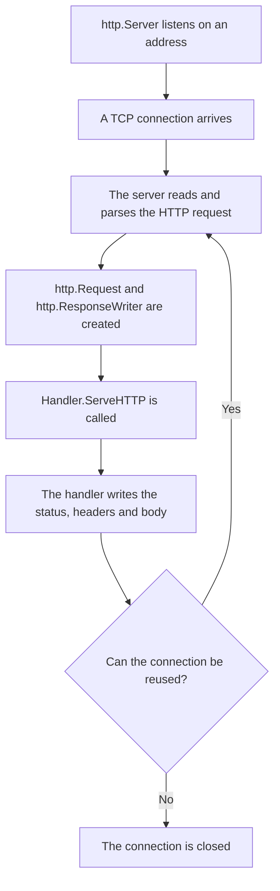

# Connection Lifecycle

The [`net/http`](https://pkg.go.dev/net/http) package hides most of the networking details: an application usually does not read directly from a TCP socket or assemble HTTP messages by hand. Still, every handler runs in the context of a specific request, response and connection. This model helps explain when [`http.Request`](https://pkg.go.dev/net/http#Request) is created, where [`http.ResponseWriter`](https://pkg.go.dev/net/http#ResponseWriter) comes from, why the order of response writes matters and what happens after the handler returns.

## Request Flow

An HTTP server in Go accepts TCP connections, reads HTTP requests from them and calls the appropriate handler ([`http.Handler`](https://pkg.go.dev/net/http#Handler)) for each request.



### 1. Accepting a Connection

When a server starts, `net/http` creates a network listener on the configured address. In simplified form, the server's internal accept loop can be imagined like this:

```go
for {
    conn, err := listener.Accept()
    if err != nil {
        return err
    }

    go serveConnection(conn)
}
```

### 2. Handling the Connection in a Goroutine

For HTTP/1.x, the standard Go server usually handles each accepted connection in its own goroutine. This means that a slow client or a long-running request on one connection does not block the server from accepting and handling other connections.

::: info
Do not treat this model as a universal "one goroutine per request" rule. With HTTP/1.1, multiple requests can pass through the same keep-alive connection one after another. With HTTP/2, multiple requests can run concurrently as independent streams inside one TCP connection.
:::

### 3. Reading the HTTP Request

After accepting a connection, the server reads bytes from the socket and parses the HTTP message:

- request line: method, path, protocol version;
- headers;
- request body stream, if present;
- connection-related metadata: `Content-Length`, `Transfer-Encoding`, `Connection`.

From this data, the server builds an [`http.Request`](https://pkg.go.dev/net/http#Request). This is the value the handler receives as its second argument.

### 4. Passing Request and ResponseWriter

By the time the handler is called, the request has already been parsed, but the response has not been written yet. That is why the server passes two values to `ServeHTTP`:

- `http.ResponseWriter`: the interface the handler uses to write the response status, headers and body;
- `*http.Request`: a pointer to the incoming request data: method, URL, headers, body and context.

::: info
Do not confuse `ResponseWriter` with [`http.Response`](/en/net-http/intro/response). `ResponseWriter` is the server-side interface for writing a response, while `http.Response` represents a response that has already been received, most often in HTTP client code or tests.
:::

### 5. Calling the Handler

After preparing `ResponseWriter` and `Request`, the server passes control to the selected handler. A handler is the part of the program that decides what to do with a specific HTTP request: check the method, read input, call services and write a response.

In `net/http`, the standard form of this call looks like this:

```go
handler.ServeHTTP(w, r)
```

::: info
The [`ServeHTTP`](https://pkg.go.dev/net/http#Handler.ServeHTTP) method is the handler entry point. This contract is explained in detail in the next article, [`The http.Handler Interface`](/en/net-http/intro/handler). For now, the key idea is simple: the server gives the handler a request and a way to write the response, and the handler runs the application logic.
:::

After `ServeHTTP` returns, the same `ResponseWriter` must not be used again. If the response is streamed, the handler must manage the streaming loop itself and finish it before returning.

::: warning
`ResponseWriter` is tied to a specific request and its connection. Do not store it in global variables and do not use it after the handler has finished.
:::

### 6. Writing the Response

Data written through `ResponseWriter` becomes an HTTP response:

```text
HTTP/1.1 200 OK
Content-Type: text/plain
Date: ...

OK
```

`net/http` adds some protocol headers by itself, manages buffering and writes the result to the network connection. The handler usually does not control the TCP socket directly.

::: info
If the client closes the connection early, writing the response can fail. In simple examples, the error from `fmt.Fprintln(w, ...)` is often omitted, but streaming handlers and production code need to account for write errors.
:::

### 7. Reusing the Connection

After the response is complete, the server decides whether the connection can remain open for the next request.

The connection can be reused if:

- the protocol and headers allow keep-alive;
- the request and response were completed correctly;
- no server timeout has expired;
- the client did not request connection close;
- the server is not shutting down.

If keep-alive is not possible, the connection is closed. If it is possible, the server waits for the next request on the same connection and repeats the cycle.

::: info
For HTTP/1.1, this is a sequential model: the next request on the same connection is usually handled after the previous response is complete. HTTP/2 uses a different model: several independent streams can exist inside one connection at the same time, but the handler still sees the familiar `*http.Request` and `http.ResponseWriter`.
:::
