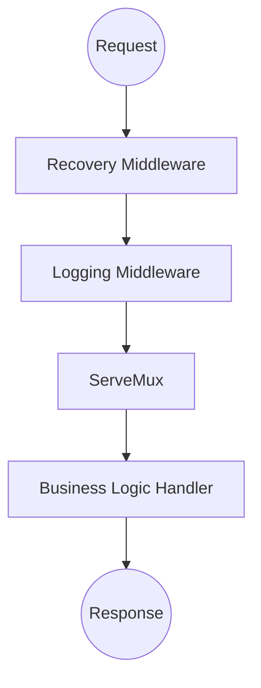

# The http.Handler Interface

The [`http.Handler`](https://pkg.go.dev/net/http#Handler) interface is the central abstraction in the [`net/http`](https://pkg.go.dev/net/http) package. In a Go HTTP server, almost every component, from a router to middleware, is built around this interface.

## Interface Definition

Any type that implements the [`ServeHTTP`](https://pkg.go.dev/net/http#Handler.ServeHTTP) method becomes a first-class HTTP component in the standard library ecosystem.

```go
type Handler interface {
    ServeHTTP(http.ResponseWriter, *http.Request)
}
```

The `ServeHTTP` method takes two arguments: [`http.ResponseWriter`](https://pkg.go.dev/net/http#ResponseWriter) for writing the response and [`*http.Request`](https://pkg.go.dev/net/http#Request) with incoming request data. After `ServeHTTP` returns, request handling is considered complete.

## Why This Interface Matters

### Component Composition

Components that implement `http.Handler` can wrap each other to form request processing chains.



::: info
The [`http.ServeMux`](https://pkg.go.dev/net/http#ServeMux) router is itself an `http.Handler`. It matches each incoming request against registered patterns and calls the most appropriate handler.
:::

### Dependency Injection

Implementing the interface on structs makes it possible to pass dependencies, such as a repository or logger, directly into a handler. This approach is especially useful when a handler depends on several collaborators, stores configuration or needs helper methods over time.

```go
type User struct {
    Name string
}

var ErrUserNotFound = errors.New("user not found")

type UserRepository interface {
    FindByID(id string) (User, error)
}

// ProfileHandler stores the dependencies used by the handler.
type ProfileHandler struct {
    repo   UserRepository
    logger *log.Logger
}

func (h *ProfileHandler) ServeHTTP(w http.ResponseWriter, r *http.Request) {
    userID := r.URL.Query().Get("id")

    user, err := h.repo.FindByID(userID)
    if err != nil {
        if errors.Is(err, ErrUserNotFound) {
            http.Error(w, "User not found", http.StatusNotFound)
            return
        }

        h.logger.Printf("error finding user %s: %v", userID, err)
        http.Error(w, "Internal Server Error", http.StatusInternalServerError)
        return
    }

    // Response write error handling is omitted.
    fmt.Fprintf(w, "Profile: %s", user.Name)
}
```

::: info
A pointer receiver lets you register a single `ProfileHandler` instance and reuse its dependencies across handler calls. The dependencies themselves must be safe for concurrent use or synchronized inside their own implementations.
:::

### Isolated Testing

The common `http.Handler` interface makes isolated testing straightforward: a handler can be called directly with a test request and a value that implements `http.ResponseWriter`. The standard library provides the [`net/http/httptest`](https://pkg.go.dev/net/http/httptest) package for this.

```go
req := httptest.NewRequest(http.MethodGet, "/?id=67", nil)
w := httptest.NewRecorder()

handler.ServeHTTP(w, req)
```

Testing patterns, status checks, response body assertions and table-driven tests are covered in the article [`Testing Handlers`](/en/net-http/testing/testing-handlers).

## Concurrent Use

An HTTP server may call the same `http.Handler` concurrently for different requests. Because of that, handlers must be safe for simultaneous use by multiple goroutines.

Mutating internal struct state inside `ServeHTTP` without synchronization leads to a data race or unpredictable behavior.

```go
type SafeHandler struct {
    mu    sync.Mutex
    cache map[string]string
}

func (h *SafeHandler) ServeHTTP(w http.ResponseWriter, r *http.Request) {
    // One handler instance can serve several requests at the same time.
    // Access to mutable state must be synchronized.
    h.mu.Lock()
    defer h.mu.Unlock()

    if h.cache == nil {
        h.cache = make(map[string]string)
    }
    h.cache[r.URL.Path] = "visited"
}
```

::: tip
Prefer stateless handlers when possible. If state is necessary and can be accessed concurrently, use synchronization primitives from the [`sync`](https://pkg.go.dev/sync) package.
:::
