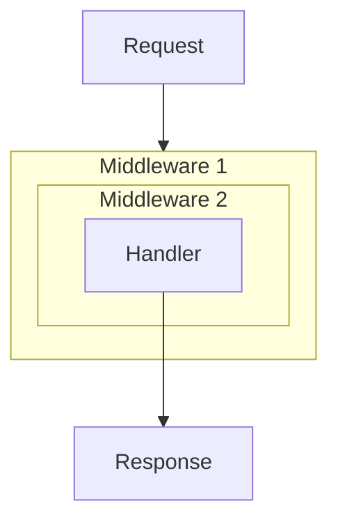

# Middleware

In Go, middleware is usually a function that accepts an [`http.Handler`](https://pkg.go.dev/net/http#Handler) and returns a new `http.Handler`. This layer can run code before the next handler, after it, or stop the chain early.

```go
func Middleware(next http.Handler) http.Handler {
    return http.HandlerFunc(func(w http.ResponseWriter, r *http.Request) {
        // Code before the next handler.
        next.ServeHTTP(w, r)
        // Code after the next handler.
    })
}
```

## Design Principles

When designing middleware, a few principles help keep the chain understandable:

1. **One layer, one responsibility:** logging, authorization, recovery and [CORS](/en/net-http/server/cors) are easier to understand and test separately.
2. **Explicit chain termination:** if middleware writes the response itself, it should return and not call `next.ServeHTTP`.
3. **One HTTP response:** after the first `WriteHeader` or `Write`, the status has been chosen. A later attempt to write another status leads to incorrect behavior or a warning in the server logs.

::: warning
After `http.Error`, `w.WriteHeader` or `w.Write`, you usually need `return` unless the current middleware should continue the chain.
:::

## Execution Order

A middleware chain works as a set of nested wrappers: the request passes through layers from outside to inside, and code after `next.ServeHTTP` runs in the reverse order.



Layer order affects behavior. Recovery middleware is usually placed on the outside, as is logging middleware when it should observe the whole chain.

::: warning
If recovery middleware is placed after logging middleware, a panic inside the logging layer itself will not be recovered.
:::

## Wrapping ResponseWriter

The standard [`http.ResponseWriter`](https://pkg.go.dev/net/http#ResponseWriter) interface does not let middleware inspect the final status code or response size after the request has been handled. Logging and recovery middleware often use a small wrapper for this.

```go
type responseWriter struct {
    http.ResponseWriter
    status      int
    bytes       int
    wroteHeader bool
}

func newResponseWriter(w http.ResponseWriter) *responseWriter {
    return &responseWriter{
        ResponseWriter: w,
        status:         http.StatusOK,
    }
}

func (rw *responseWriter) WriteHeader(code int) {
    if rw.wroteHeader {
        return
    }

    rw.status = code
    rw.wroteHeader = true
    rw.ResponseWriter.WriteHeader(code)
}

func (rw *responseWriter) Write(b []byte) (int, error) {
    if !rw.wroteHeader {
        rw.WriteHeader(http.StatusOK)
    }

    n, err := rw.ResponseWriter.Write(b)
    rw.bytes += n
    return n, err
}

func (rw *responseWriter) Unwrap() http.ResponseWriter {
    return rw.ResponseWriter
}
```

The `Write` method explicitly records the implicit `200 OK` status, while `WriteHeader` ignores repeated status writes. The `bytes` field counts the number of bytes actually written.

The `Unwrap` method is not needed for logging itself. It exists for compatibility with advanced `ResponseWriter` capabilities. For example, [`http.ResponseController`](/en/net-http/server/responsecontroller) can unwrap this wrapper, reach the original writer and call `Flush`, `Hijack` or deadline-management methods if the current connection supports them.

## Practical Examples

### 1. Recovery Middleware

Recovery middleware catches a `panic` in the current goroutine and prevents the server from dropping the connection without a controlled response. If the response has already started, the middleware does not try to send a new `500` status.

```go
func Recovery(next http.Handler) http.Handler {
    return http.HandlerFunc(func(w http.ResponseWriter, r *http.Request) {
        rw := newResponseWriter(w)

        // defer makes it possible to recover from a panic in the current goroutine.
        defer func() {
            if err := recover(); err != nil {
                log.Printf("panic recovered: %v", err)

                if rw.wroteHeader {
                    return
                }

                http.Error(rw, "Internal Server Error", http.StatusInternalServerError)
            }
        }()

        next.ServeHTTP(rw, r)
    })
}
```

### 2. Logging Middleware

Logging middleware uses the same wrapper to record status, response size and request duration.

```go
func Logging(next http.Handler) http.Handler {
    return http.HandlerFunc(func(w http.ResponseWriter, r *http.Request) {
        start := time.Now()

        requestID := uuid.New().String() // "github.com/google/uuid"
        w.Header().Set("X-Request-ID", requestID)

        rw := newResponseWriter(w)
        next.ServeHTTP(rw, r)

        log.Printf("[%s] %s %s %d %dB %v",
            requestID, r.Method, r.URL.Path, rw.status, rw.bytes, time.Since(start))
    })
}
```

### 3. Auth Middleware

Auth middleware demonstrates short-circuiting: ending the chain early without calling the next handler. If the token is missing, it sends `401` and returns.

```go
type contextKey string
const userIDKey contextKey = "user_id"

func Auth(next http.Handler) http.Handler {
    return http.HandlerFunc(func(w http.ResponseWriter, r *http.Request) {
        token := r.Header.Get("Authorization")
        if token == "" {
            http.Error(w, "Unauthorized", http.StatusUnauthorized)
            return
        }

        userID := "user_123"
        ctx := context.WithValue(r.Context(), userIDKey, userID)

        next.ServeHTTP(w, r.WithContext(ctx))
    })
}
```

::: tip
`context.WithValue` does not modify the existing context. It creates a new one. To pass data further down the chain, use `r.WithContext(ctx)`.
:::

## Building Middleware Chains

With many middleware layers, nested calls like `M1(M2(M3(handler)))` quickly become hard to read. A small composer function can build the chain automatically.

```go
// Chain wraps the handler with the middleware list in order.
func Chain(h http.Handler, mws ...func(http.Handler) http.Handler) http.Handler {
    for i := len(mws) - 1; i >= 0; i-- {
        h = mws[i](h)
    }
    return h
}

// Example: Chain(handler, M1, M2, M3)
// Recovery -> Logging -> Auth -> finalHandler
handler := Chain(finalHandler, Recovery, Logging, Auth)
```
