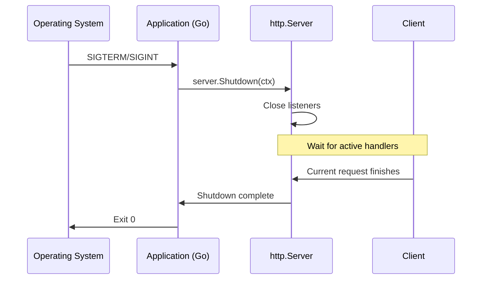

# Graceful Shutdown

**Graceful shutdown** is the process of stopping a server without immediately dropping active work. The server stops accepting new requests, but lets already accepted requests finish. This helps avoid data loss, interrupted transactions and unnecessary `502 Bad Gateway` errors from load balancers.

If the process is terminated forcefully, for example by an unhandled signal or [`os.Exit`](https://pkg.go.dev/os#Exit), all active connections are closed immediately and `defer` calls inside handlers do not run.

## Server Shutdown Methods

Starting with Go 1.8, [`http.Server`](https://pkg.go.dev/net/http#Server) provides two methods for controlled shutdown: [`Shutdown`](https://pkg.go.dev/net/http#Server.Shutdown) and [`RegisterOnShutdown`](https://pkg.go.dev/net/http#Server.RegisterOnShutdown).

### Shutdown

`Shutdown` gracefully shuts down the server without forcibly closing active connections. It first closes all open listeners, then closes idle connections. After that, it waits for the remaining active connections to become idle before the server fully stops.

```go
func (srv *Server) Shutdown(ctx context.Context) error
```

### RegisterOnShutdown

`RegisterOnShutdown` registers a callback that runs at the beginning of the shutdown process. It is intended for protocol-specific shutdown work for connections that `Shutdown` does not directly manage, such as hijacked connections after a WebSocket upgrade.

```go
func (srv *Server) RegisterOnShutdown(f func())
```

## How Shutdown Works

A shutdown through `Shutdown` follows these steps:

1. All open listening sockets are closed, so new connections are no longer accepted.
2. All idle connections are closed.
3. The server waits for active requests to finish.
4. If the provided context expires before all requests finish, `Shutdown` returns the context error.



## Implementation

Since Go 1.16, [`signal.NotifyContext`](https://pkg.go.dev/os/signal#NotifyContext) is the recommended way to handle OS signals. It integrates with the context tree and cancels the context when a signal is received.

```go
package main

import (
    "context"
    "errors"
    "log"
    "net/http"
    "os"
    "os/signal"
    "syscall"
    "time"
)

func main() {
    mux := http.NewServeMux()
    // Register handlers...

    srv := &http.Server{
        Addr:    ":8080",
        Handler: mux,
    }

    // signal.NotifyContext cancels ctx when SIGINT or SIGTERM is received.
    // Calling stop() releases resources and restores default signal behavior,
    // so a second SIGINT interrupts shutdown forcefully.
    ctx, stop := signal.NotifyContext(context.Background(), os.Interrupt, syscall.SIGTERM)
    defer stop()

    // Start the server in a goroutine so main can wait for a signal.
    go func() {
        log.Printf("server starting on %s", srv.Addr)
        if err := srv.ListenAndServe(); !errors.Is(err, http.ErrServerClosed) {
            log.Fatalf("listen error: %s", err)
        }
    }()

    // Block until a signal is received.
    <-ctx.Done()
    stop() // Explicit call: a second SIGINT now terminates the process immediately.
    log.Println("shutting down server...")

    // Timeout for shutdown.
    shutdownCtx, cancel := context.WithTimeout(context.Background(), 25*time.Second)
    defer cancel()

    if err := srv.Shutdown(shutdownCtx); err != nil {
        // Call cancel explicitly before exiting:
        // log.Fatalf calls os.Exit and skips deferred calls.
        cancel()

        log.Fatalf("forced shutdown: %s", err)
    }

    log.Println("server exited gracefully")
}
```

::: tip
[`ListenAndServe`](https://pkg.go.dev/net/http#ListenAndServe) and [`ListenAndServeTLS`](https://pkg.go.dev/net/http#ListenAndServeTLS) always return a non-nil error. During a normal shutdown through `Shutdown`, they return [`http.ErrServerClosed`](https://pkg.go.dev/net/http#ErrServerClosed). Checking with [`errors.Is`](https://pkg.go.dev/errors#Is) is preferable to direct comparison (`err != http.ErrServerClosed`) because it handles wrapped errors correctly.
:::

## Shutting Down Non-standard Connections

`Shutdown` does not manage connections that have been hijacked. A typical example is a WebSocket connection after an HTTP upgrade: it is no longer managed by `http.Server` as a normal HTTP request.

For such connections, `RegisterOnShutdown` lets you start protocol-specific shutdown work: send a close frame, close application channels or stop background goroutines. All registered callbacks are called **concurrently**, and `Shutdown` does not wait for them to finish. If the application must wait for cleanup before leaving `main`, that waiting must be implemented separately.

```go
package main

import (
    "context"
    "log"
    "net/http"
    "sync"
    "time"

    "github.com/gorilla/websocket"
)

// Hub manages active WebSocket connections.
type Hub struct {
    conns map[*websocket.Conn]struct{}
    mu    sync.Mutex
}

func (h *Hub) Register(conn *websocket.Conn) {
    h.mu.Lock()
    h.conns[conn] = struct{}{}
    h.mu.Unlock()
}

func (h *Hub) CloseAll() {
    // Copy connections while holding the lock, then close them outside it.
    // conn.Close() can block, for example while flushing a buffer,
    // so holding the mutex during Close would block every other connection.
    h.mu.Lock()
    conns := make([]*websocket.Conn, 0, len(h.conns))
    for conn := range h.conns {
        conns = append(conns, conn)
    }
    h.mu.Unlock()

    for _, conn := range conns {
        conn.Close()
    }
}

func main() {
    hub := &Hub{conns: make(map[*websocket.Conn]struct{})}
    srv := &http.Server{Addr: ":8080"}

    // wg.Add is called before RegisterOnShutdown to avoid a race with wg.Wait:
    // Shutdown may run the callback before main reaches wg.Wait.
    var wg sync.WaitGroup
    wg.Add(1)
    srv.RegisterOnShutdown(func() {
        defer wg.Done()
        hub.CloseAll()
    })

    // ... server startup and signal handling logic, as shown above

    shutdownCtx, cancel := context.WithTimeout(context.Background(), 25*time.Second)
    defer cancel()

    if err := srv.Shutdown(shutdownCtx); err != nil {
        log.Printf("shutdown error: %s", err)
    }

    // Wait for cleanup, but no longer than a separate timeout.
    done := make(chan struct{})
    go func() {
        wg.Wait()
        close(done)
    }()

    select {
    case <-done:
    case <-time.After(5 * time.Second):
        log.Println("shutdown cleanup timed out")
    }

    log.Println("server exited gracefully")
}
```

::: warning
[`wg.Add`](https://pkg.go.dev/sync#WaitGroup.Add) must be called before registering the callback. That way, the `WaitGroup` counter is already incremented when `Shutdown` is able to run the callback.
:::
