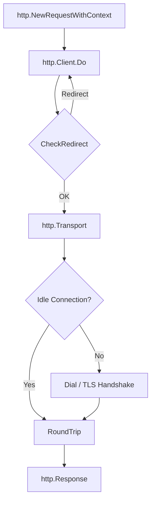

# Creating and Sending Requests

Creating and sending an HTTP request in Go requires explicit control over the request context and data. [`http.NewRequestWithContext`](https://pkg.go.dev/net/http#NewRequestWithContext) is the standard choice for reliable application code because it lets you control the request lifetime.

## Request Lifecycle

Before sending a request, it helps to understand how it moves through the Go HTTP client stack.



## Creating a Request

[`http.NewRequestWithContext`](https://pkg.go.dev/net/http#NewRequestWithContext) creates an [`*http.Request`](https://pkg.go.dev/net/http#Request) with an attached context.

```go
func NewRequestWithContext(ctx context.Context, method, url string, body io.Reader) (*http.Request, error)
```

| Argument | Description |
| :------- | :---------- |
| `ctx` | Request context. It is used for timeouts, deadlines and cancellation. It must not be `nil`; if there is no specific context, use `context.Background()` or `context.TODO()`. |
| `method` | HTTP method: `http.MethodGet`, `http.MethodPost`, `http.MethodPut` and so on. Passing an empty string defaults to `GET`, but application code should usually specify the method explicitly. |
| `url` | Request URL as a string. An invalid URL returns an error while the request is being created. |
| `body` | Request body as an `io.Reader`. Use `nil` for requests without a body. |

This function does not perform any network I/O. It only builds the description of a future request: method, URL, headers, body and the context that can cancel it. The actual network operation starts later, when the prepared request is passed to [`client.Do`](https://pkg.go.dev/net/http#Client.Do).

```go
func fetch(ctx context.Context, client *http.Client, url string) (*http.Response, error) {
    req, err := http.NewRequestWithContext(ctx, http.MethodGet, url, nil)
    if err != nil {
        return nil, fmt.Errorf("create request: %w", err)
    }

    resp, err := client.Do(req)
    if err != nil {
        return nil, fmt.Errorf("execute request: %w", err)
    }

    return resp, nil
}
```

::: warning
Creating a request can fail, for example when the URL is invalid or uses an unsupported scheme. Handle the error from `NewRequestWithContext` before setting headers or executing the request.
:::

## Managing Headers

Request headers are available through the [`r.Header`](https://pkg.go.dev/net/http#Header) field. The [`net/http`](https://pkg.go.dev/net/http) package automatically canonicalizes header keys; for example, `auth-token` becomes `Auth-Token`.

| Method | Description |
| :----- | :---------- |
| [`r.Header.Set(key, value)`](https://pkg.go.dev/net/http#Header.Set) | Sets the value and replaces any existing values. |
| [`r.Header.Add(key, value)`](https://pkg.go.dev/net/http#Header.Add) | Adds another value for the same key. |
| [`r.Header.Get(key)`](https://pkg.go.dev/net/http#Header.Get) | Returns the first value for the key. |

```go
r.Header.Set("Content-Type", "application/json")
r.Header.Set("Authorization", "Bearer secret-token")
```

## Sending Data in the Body

The request body in `http.Request` is represented by the [`io.Reader`](https://pkg.go.dev/io#Reader) interface. This makes it possible to stream data from different sources without unnecessary memory overhead.

### Sending JSON

For JSON request bodies, an idiomatic and efficient approach is to encode the struct directly into a [`bytes.Buffer`](https://pkg.go.dev/bytes#Buffer) with [`json.Encoder`](https://pkg.go.dev/encoding/json#Encoder). This avoids the extra intermediate byte slice allocation you get with [`json.Marshal`](https://pkg.go.dev/encoding/json#Marshal).

In addition, `http.NewRequestWithContext` recognizes `*bytes.Buffer`, calculates the correct size for the `Content-Length` header and sets up body replay through [`r.GetBody`](https://pkg.go.dev/net/http#Request.GetBody), which is useful for HTTP redirects.

```go
type APIClient struct {
    baseURL    string
    httpClient *http.Client
}

type User struct {
    Name string `json:"name"`
}

func (c *APIClient) CreateUser(ctx context.Context, user User) error {
    endpoint := c.baseURL + "/v1/users"

    var buf bytes.Buffer
    if err := json.NewEncoder(&buf).Encode(user); err != nil {
        return fmt.Errorf("encode request body: %w", err)
    }

    req, err := http.NewRequestWithContext(ctx, http.MethodPost, endpoint, &buf)
    if err != nil {
        return fmt.Errorf("create request: %w", err)
    }
    req.Header.Set("Content-Type", "application/json")

    resp, err := c.httpClient.Do(req)
    if err != nil {
        return fmt.Errorf("execute request: %w", err)
    }
    defer resp.Body.Close()

    _, _ = io.Copy(io.Discard, resp.Body)

    if resp.StatusCode != http.StatusCreated {
        return fmt.Errorf("unexpected status: %s", resp.Status)
    }

    return nil
}
```

::: info
After a successful `client.Do(req)`, always close the response body. If the response is not otherwise read to EOF and you want the connection to return to the keep-alive pool, it is common to drain the body into `io.Discard` and then close it: `_, _ = io.Copy(io.Discard, resp.Body)`.
:::
