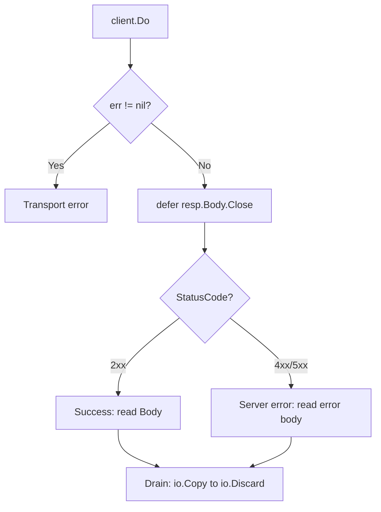

# Reading and Handling Responses

The result of an HTTP request is returned as an [`http.Response`](/en/net-http/intro/response). Correct response handling is critical for application stability: mistakes around response body management are a common source of memory and file descriptor leaks.

## Handling Flow

After receiving a response from [`client.Do`](https://pkg.go.dev/net/http#Client.Do), follow a strict sequence.



### 1. Check Transport Errors

The first thing to check is the error returned by `Do`. It represents network-level failures: timeouts, DNS errors or broken connections. In this case, `resp` is `nil`.

```go
resp, err := client.Do(req)
if err != nil {
    // In most cases, accessing resp.Body here would panic.
    return err
}
```

::: info
For classic network errors such as timeouts or DNS failures, `resp` is always `nil`. Redirect policy errors are the exception, for example with a custom [`CheckRedirect`](https://pkg.go.dev/net/http#Client.CheckRedirect). In that case, `Do` may return both an error and a non-nil `resp`, but its body ([`resp.Body`](https://pkg.go.dev/net/http#Response.Body)) has already been closed by the standard library.
:::

### 2. Close the Body

If the error is `nil`, the response body **must** be closed. The usual practice is to defer the close immediately after the error check.

```go
defer resp.Body.Close()
```

### 3. Check the Status Code

If there was no transport error, check the logical result of the request through [`resp.StatusCode`](https://pkg.go.dev/net/http#Response.StatusCode).

```go
if resp.StatusCode != http.StatusOK {
    return fmt.Errorf("unexpected status: %s", resp.Status)
}
```

## Resource Management: Draining the Body

For the TCP connection to return to the keep-alive pool and be reused, the response body has to be read all the way to [`io.EOF`](https://pkg.go.dev/io#EOF), even if you do not need its contents.

```go
func processResponse(resp *http.Response) error {
    defer resp.Body.Close()

    _, err := io.Copy(io.Discard, resp.Body)
    return err
}
```

::: warning
If the response body is not closed or is not read to EOF, the connection will be closed, and the next request to the same server will need a new TCP/TLS connection.
:::

## Parsing Data

For JSON responses, use [`json.Decoder`](https://pkg.go.dev/encoding/json#Decoder). It reads from the stream and is more efficient than [`json.Unmarshal`](https://pkg.go.dev/encoding/json#Unmarshal) after first reading the entire body with [`io.ReadAll`](https://pkg.go.dev/io#ReadAll).

```go
type UserResponse struct {
    ID   int    `json:"id"`
    Name string `json:"name"`
}

var user UserResponse
if err := json.NewDecoder(resp.Body).Decode(&user); err != nil {
    return fmt.Errorf("failed to decode JSON: %w", err)
}
```

## Reading Headers

Response headers are available through the [`resp.Header`](https://pkg.go.dev/net/http#Response.Header) map.

For most single-value headers, [`Header.Get`](https://pkg.go.dev/net/http#Header.Get) is enough: it canonicalizes the header name and returns the first value. If a header can appear multiple times, such as `Warning` or other multi-value headers, use [`Header.Values`](https://pkg.go.dev/net/http#Header.Values) or access the value slice directly.

```go
contentType := resp.Header.Get("Content-Type")
server := resp.Header.Get("Server")
```

If the header is missing, `Get` returns an empty string. When you need to distinguish a missing header from an empty value, check whether the key exists in `resp.Header`.

```go
values, ok := resp.Header["X-Request-Id"]
if !ok || len(values) == 0 {
    return fmt.Errorf("missing X-Request-Id header")
}

requestID := values[0]
```

## Reading Cookies

To read cookies set by the server in the current response, use [`resp.Cookies`](https://pkg.go.dev/net/http#Response.Cookies). It parses `Set-Cookie` headers and returns them as a slice of [`*http.Cookie`](https://pkg.go.dev/net/http#Cookie), so you do not have to parse headers manually.

```go
for _, cookie := range resp.Cookies() {
    fmt.Printf("Cookie: %s = %s\n", cookie.Name, cookie.Value)
}
```

::: warning
`resp.Cookies()` only reads cookies from this specific response. If the client should automatically store them and send them on later requests, configure [`http.Client.Jar`](https://pkg.go.dev/net/http#Client) with [`cookiejar`](https://pkg.go.dev/net/http/cookiejar). This is covered in `Cookies in HTTP Clients`.
:::
