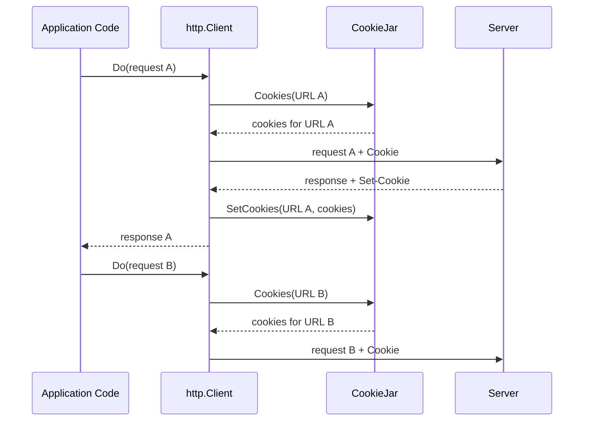

# Cookies in HTTP Clients

Cookies in an HTTP client are necessary when multiple requests need to share state: an authentication session, a CSRF token, user preferences, or any other identifier passed by the server via the `Set-Cookie` header.

It's important to distinguish between three things:

| Part         | Location                           | Purpose                                                              |
| :----------- | :--------------------------------- | :------------------------------------------------------------------- |
| `Set-Cookie` | In the server's response           | The server requests the client to store a cookie.                    |
| `Cookie`     | In the client's subsequent request | The client sends a previously stored cookie back to the server.      |
| `CookieJar`  | Inside the Go client               | Stores cookies and decides which ones are suitable for a specific URL. |

HTTP itself is stateless and does not retain state between requests. The server merely sends the `Set-Cookie` instruction, and the client decides whether to store it and when to send it back. In a browser, the built-in cookie store handles this. In Go, `http.CookieJar` plays this role, provided it is configured in the client.

By default, [`http.Client`](https://pkg.go.dev/net/http#Client) does not persist cookies across requests. It will only send cookies in two scenarios:

- Cookies are explicitly added to a specific [`http.Request`](https://pkg.go.dev/net/http#Request), for example, using [`req.AddCookie`](https://pkg.go.dev/net/http#Request.AddCookie).
- The [`Client.Jar`](https://pkg.go.dev/net/http#Client.Jar) field is configured, and the jar selects matching cookies for the request's URL.

The first option is suitable for a one-off request. The second is required when the client must act statefully (like a browser) and automatically propagate cookies between requests.

## The CookieJar Interface

The `http.Client.Jar` field implements the [`http.CookieJar`](https://pkg.go.dev/net/http#CookieJar) interface:

```go
type CookieJar interface {
    SetCookies(u *url.URL, cookies []*http.Cookie)
    Cookies(u *url.URL) []*http.Cookie
}
```

The methods of this interface separate two operations:

- `SetCookies` stores cookies that the server has set for a specific response URL.
- `Cookies` returns cookies that can be sent to a specific request URL.

A ready-to-use implementation is provided in the [`net/http/cookiejar`](https://pkg.go.dev/net/http/cookiejar) package. It is sufficient for most clients that need to keep cookies in the process memory.

## The CookieJar Lifecycle

The `http.Client` automatically links server responses to subsequent requests if a `CookieJar` is provided.

Before every request, the client queries the jar for cookies suitable for the target URL and appends them to the `Cookie` header. After receiving a response, the client parses the `Set-Cookie` headers and passes the extracted cookies back to the jar. This way, the jar accumulates state progressively, and your application can keep using `client.Do(...)` without manually assembling headers.

A single cycle looks like this:

1. The application creates and executes a request via `http.Client`.
2. The client retrieves cookies for the request's URL from the `CookieJar`.
3. The server responds and may return one or more `Set-Cookie` headers.
4. The client stores these cookies in the `CookieJar`.
5. The next request from the same client uses the updated cookie set.

The diagram below illustrates this exchange for two sequential requests:



Crucially, the application code usually doesn't call `SetCookies` manually. The `http.Client` handles this automatically after receiving the response.

## Client Configuration

To enable automatic cookie management, you must create a jar and assign it to the `Jar` field of your `http.Client`. From that point on, it is important to reuse this specific client instance for all requests that need to share the same state.

A minimal setup looks like this:

```go
jar, err := cookiejar.New(nil)
if err != nil {
    return fmt.Errorf("create cookie jar: %w", err)
}

client := &http.Client{
    Jar:     jar,
    Timeout: 10 * time.Second,
}
```

Calling [`cookiejar.New`](https://pkg.go.dev/net/http/cookiejar#New) creates the standard `http.CookieJar` implementation from the `net/http/cookiejar` package:

```go
func New(o *cookiejar.Options) (*cookiejar.Jar, error)
```

::: info
While the standard implementation always returns a `nil` error, the `cookiejar.New` signature includes an `error`, so you still have to handle it. This ensures your code remains robust against future changes or if you swap out the implementation.
:::

The [`cookiejar.Options`](https://pkg.go.dev/net/http/cookiejar#Options) struct defines the jar's policy. Currently, it has a single field, `PublicSuffixList`, which helps the jar distinguish between privately owned domains and public domain zones like `.com`, `.co.uk`, or `github.io`.

Passing `nil` creates a jar with no configurations. This is fine for simple examples and tests, but it is insecure for clients making requests to external or user-provided domains. The implementation of the public suffix list can be found in the `golang.org/x/net/publicsuffix` package.

```go
jar, err := cookiejar.New(&cookiejar.Options{
    PublicSuffixList: publicsuffix.List,
})
if err != nil {
    return fmt.Errorf("create cookie jar: %w", err)
}
```

## How Cookies Are Selected

The `CookieJar` doesn't append all stored cookies to every request. For a given URL, it selects only those values that match the scope criteria.

Key constraints:

| Attribute            | What it Restricts                                  |
| :------------------- | :------------------------------------------------- |
| `Domain`             | The hosts to which the cookie can be sent.         |
| `Path`               | The URL paths for which the cookie is considered valid. |
| `Secure`             | Limits transmission to HTTPS only.                 |
| `Expires`, `Max-Age` | The cookie's lifetime.                             |

::: info
In the `net/http/cookiejar` implementation, localhost and loopback addresses are treated as secure origins, meaning a cookie with the `Secure` attribute can be valid for a local HTTP request.
:::

If the server sends `Set-Cookie` without a `Domain`, the cookie is pinned to the response host. Such a cookie will not be sent to adjacent subdomains.

If the server specifies a `Domain`, the jar verifies whether the server is authorized to set a cookie for that domain. The strictness of this check depends on the `PublicSuffixList` provided when the jar was created.

`Path` narrows the scope within a site. A cookie with `Path=/admin` applies to `/admin` and `/admin/users`, but not to `/api`.

For example, a cookie with the following attributes:

```http
Set-Cookie: session=abc; Domain=example.com; Path=/admin; Secure
```

will be sent to `https://example.com/admin/users`, but will NOT be sent to `http://example.com/admin/users`, `https://api.other.com/admin/users`, or `https://example.com/api`.

::: info
`HttpOnly` and `SameSite` are primarily relevant for browsers. A typical Go client does not execute JavaScript and lacks a browser-like "same-site" navigational context.
:::

## Lifetime and Storage

The standard `cookiejar.Jar` stores cookies in the process memory. Once the application restarts, the stored state is lost.

This behavior is perfectly fine for short-lived clients, tests, or services that acquire a new session upon startup. If you need to persist a session across restarts, you must provide your own `http.CookieJar` implementation or write a separate layer to serialize and restore the cookies.

## Inspecting Stored Cookies

You can call the `Cookies` method directly to inspect which cookies the jar will choose for a specific URL. This does not trigger an actual HTTP request.

```go
func printCookies(client *http.Client, rawURL string) error {
    if client.Jar == nil {
        return fmt.Errorf("cookie jar is not configured")
    }

    u, err := url.Parse(rawURL)
    if err != nil {
        return fmt.Errorf("parse URL: %w", err)
    }

    for _, cookie := range client.Jar.Cookies(u) {
        fmt.Printf("%s=%s\n", cookie.Name, cookie.Value)
    }

    return nil
}
```

This technique is useful in tests and when debugging authentication. It allows you to verify not only whether a cookie was received but also whether it is correctly scoped for the next URL.

## Sequential Requests

Once the `Jar` is configured, the same client can be used for a sequence of requests sharing a common state. For example, the first request establishes a session, and the second request relies on that session to access a protected page.

```go
func openDashboard(ctx context.Context, client *http.Client, baseURL string) error {
    loginReq, err := http.NewRequestWithContext(ctx, http.MethodGet, baseURL+"/login", nil)
    if err != nil {
        return fmt.Errorf("create login request: %w", err)
    }

    loginResp, err := client.Do(loginReq)
    if err != nil {
        return fmt.Errorf("execute login request: %w", err)
    }
    defer loginResp.Body.Close()

    if loginResp.StatusCode != http.StatusOK {
        return fmt.Errorf("unexpected login status: %s", loginResp.Status)
    }

    dashboardReq, err := http.NewRequestWithContext(ctx, http.MethodGet, baseURL+"/dashboard", nil)
    if err != nil {
        return fmt.Errorf("create dashboard request: %w", err)
    }

    dashboardResp, err := client.Do(dashboardReq)
    if err != nil {
        return fmt.Errorf("execute dashboard request: %w", err)
    }
    defer dashboardResp.Body.Close()

    if dashboardResp.StatusCode != http.StatusOK {
        return fmt.Errorf("unexpected dashboard status: %s", dashboardResp.Status)
    }

    return nil
}
```

Between these requests, there is no need to manually read the `Set-Cookie` header and construct a `Cookie` header. If the server sets a matching cookie on `/login`, the `http.Client` automatically ingests it into the `CookieJar` and attaches it to the subsequent `/dashboard` request.

## Cookies and Redirects

The `CookieJar` is also involved in redirect chains. If an intermediate `3xx` response includes a `Set-Cookie` header, the client updates the jar before executing the next jump, then selects appropriate cookies for the `Location` URL.

A typical authentication flow looks like this:

1. The client sends a request to `/login`.
2. The server responds with `302 Found` and includes a `Set-Cookie` header.
3. The `http.Client` stores the cookie in the `Jar`.
4. The client follows the URL specified in the `Location` header.
5. Before the new request is dispatched, the `Jar` provides the cookie if it matches the domain, path, and scheme.

If the `Jar` is `nil`, the client will still follow redirects, but it will not automatically persist cookies between them. The redirect policy of `http.Client` is covered in detail in the [Redirects in HTTP Clients](./redirects) article.
