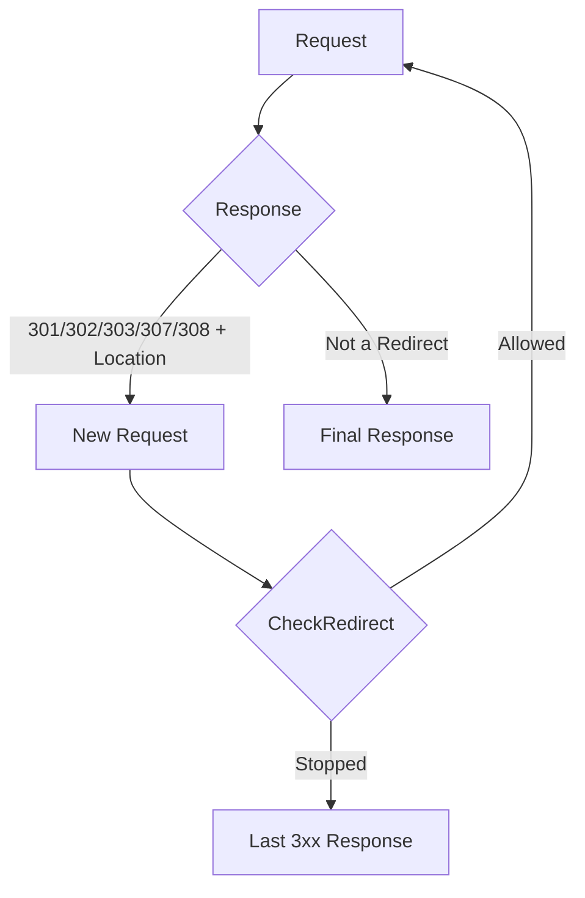

# Redirects in HTTP Clients

In the context of an [`http.Client`](https://pkg.go.dev/net/http#Client), a redirect is a response with a status code of `301`, `302`, `303`, `307`, or `308` and a `Location` header. For these specific statuses, the standard Go client can automatically perform a subsequent request.

Following redirects happens at the `http.Client` level: the client itself decides whether to make the next request, which headers to carry over, how to apply cookies, and when to stop the chain.

The [`http.Transport`](https://pkg.go.dev/net/http#Transport) is only responsible for a single network [`RoundTrip`](https://pkg.go.dev/net/http#RoundTripper.RoundTrip). It returns the response as a regular HTTP response and does not make decisions about following the `Location` header.

## Redirect Chain Execution

By default, `http.Client` automatically follows supported redirect responses and stops after 10 consecutive requests in a single chain. If a server creates an infinite loop, the client returns an error once this limit is reached.

A single redirect hop looks like this:

1. The client executes the initial request.
2. The server returns a supported redirect status and a `Location` header.
3. The `http.Client` creates a new `http.Request` for the URL in the `Location` header.
4. Before dispatching the new request, the client calls `CheckRedirect`.
5. If the redirect is permitted, the client executes the next request.
6. Once the chain concludes, the application receives the final response.



Intermediate responses are not returned to the calling code unless the redirect is explicitly stopped. Other `3xx` responses, as well as supported redirect statuses missing a `Location` header, do not automatically trigger a subsequent request and are returned as standard responses.

## Redirect Chain Behavior

The behavior of the redirect chain is controlled via the [`CheckRedirect`](https://pkg.go.dev/net/http#Client.CheckRedirect) field in the `http.Client` struct:

```go
CheckRedirect func(req *http.Request, via []*http.Request) error
```

This function is invoked right before executing the next request:

- `req` is the new request the client is about to execute, based on the `Location` header.
- `via` contains the previous requests in the current chain, ordered from earliest to latest.

The returned error determines the subsequent behavior:

- `nil` permits the next redirect.
- [`http.ErrUseLastResponse`](https://pkg.go.dev/net/http#ErrUseLastResponse) stops the redirects and returns the last `3xx` response without an error.
- Any other error aborts the execution, and the client returns it wrapped in a [`*url.Error`](https://pkg.go.dev/net/url#Error).

::: info
If `CheckRedirect` returns a standard error, `client.Do` might return a non-nil `resp`, but the response body will already be closed by the standard library. This is an exception to the general rule that "if `err != nil`, the response is usually absent."
:::

## Status and HTTP Method

The redirect status impacts not only the new URL but also the HTTP method of the subsequent request. This is especially crucial for requests with a body, such as a `POST`.

| Status                   | Typical Meaning                         | `http.Client` Behavior                                       |
| :----------------------- | :-------------------------------------- | :----------------------------------------------------------- |
| `301 Moved Permanently`  | Resource permanently moved              | The next request becomes `GET`, unless the initial was `HEAD`. |
| `302 Found`              | Temporary redirect                      | The next request becomes `GET`, unless the initial was `HEAD`. |
| `303 See Other`          | Result available at another URL         | The next request becomes `GET`, unless the initial was `HEAD`. |
| `307 Temporary Redirect` | Temporary redirect, keep method         | The method is preserved; the body is replayed if it can be read again. |
| `308 Permanent Redirect` | Permanent redirect, keep method         | The method is preserved; the body is replayed if it can be read again. |

For `301`, `302`, and `303`, the standard client changes the method to `GET` unless the original request was a `HEAD`. For `307` and `308`, the method is retained. If the initial request has a non-nil body, the client must be able to read it again via [`Request.GetBody`](https://pkg.go.dev/net/http#Request.GetBody).

[`http.NewRequestWithContext`](https://pkg.go.dev/net/http#NewRequestWithContext) automatically configures `Request.GetBody` for certain standard body types like `*bytes.Buffer`, `*bytes.Reader`, and `*strings.Reader`.

::: warning
If a request with a non-nil body is created from a forward-only stream, like a network connection or a file without rewind configuration, a `307` or `308` redirect will not execute automatically. In such cases, `http.Client` will return the last `3xx` response to the caller without an error.
:::

## Stopping a Redirect

Sometimes an application needs to process a `3xx` response manually: to inspect the `Location`, log the status code, or make a decision based on the destination domain. To achieve this, `CheckRedirect` should return `http.ErrUseLastResponse`.

```go
client := &http.Client{
    CheckRedirect: func(req *http.Request, via []*http.Request) error {
        return http.ErrUseLastResponse
    },
}
```

In this mode, `client.Do` returns the redirect response itself instead of the result of the subsequent request. The response body remains open, so it must be closed after processing.

```go
resp, err := client.Get("http://example.com")
if err != nil {
    return fmt.Errorf("execute request: %w", err)
}
defer resp.Body.Close()

if resp.StatusCode >= 300 && resp.StatusCode < 400 {
    location := resp.Header.Get("Location")
    fmt.Println("redirect location:", location)
}
```

## Redirect Chain Limits

The standard limit of 10 consecutive requests is suitable for most use cases, but it can be tightened for a specific client.

```go
client := &http.Client{
    CheckRedirect: func(req *http.Request, via []*http.Request) error {
        const maxRequestsInChain = 3
        if len(via) >= maxRequestsInChain {
            return fmt.Errorf("redirect chain limit exceeded: %d", maxRequestsInChain)
        }

        return nil
    },
}
```

The `via` slice already contains the requests executed in the current chain, so checking `len(via) >= maxRequestsInChain` prevents the execution of the next request once the limit is hit. Since a custom error is returned, `client.Do` will expose it as part of a `*url.Error`.

## Headers During Redirects

When redirecting, `http.Client` creates a new `http.Request`. Most headers from the original request are carried over automatically, but sensitive headers are handled with caution.

The standard library does not propagate `Authorization`, `WWW-Authenticate`, or `Cookie` to untrusted domains. A redirect from `example.com` to `api.example.com` is considered a safe transfer, but a redirect from `example.com` to `other.example` is not.

::: warning
Passing credentials during a redirect to a different domain requires explicit validation of the target host. Mechanically copying the `Authorization` or `Cookie` header inside `CheckRedirect` might expose secrets to an external service.
:::

If a custom application header is safe for the entire redirect chain, it can be propagated manually.

```go
client := &http.Client{
    CheckRedirect: func(req *http.Request, via []*http.Request) error {
        previous := via[len(via)-1]
        if traceID := previous.Header.Get("X-Trace-ID"); traceID != "" {
            req.Header.Set("X-Trace-ID", traceID)
        }

        return nil
    },
}
```

## Cookies During Redirects

If the client is configured with a [`Jar`](https://pkg.go.dev/net/http#Client.Jar), `http.Client` utilizes it at every step of the redirect chain: it first saves the `Set-Cookie` headers from the intermediate response, then constructs the new request based on the `Location`, and only after that selects cookies for the new URL.

The key detail is that cookies are not matched against the URL that returned the redirect, but against the URL of the subsequent request. Consequently, a redirect can alter the set of sent cookies even within a single chain. For example, a cookie set at `/login` might not be sent to `/dashboard` if its `Path` attribute is too restrictive. A redirect to a different host also re-evaluates the `CookieJar` rules, so a host-only cookie will not automatically be forwarded to a neighboring domain.

::: warning
The `CookieJar` restricts cookie transmission based on domain, path, and scheme rules, but it is not responsible for determining if the redirect itself is trustworthy. If the client should not navigate to an external domain, that must be verified in `CheckRedirect`.
:::

If `Jar` is `nil`, the client can still follow redirects but will not persist cookies from intermediate responses. An explicitly provided `Cookie` header remains a standard request header: it does not update based on `Set-Cookie` responses and does not become client session state.

For a session-based client, it is far better to use a `CookieJar` rather than manually transferring the `Cookie` header inside `CheckRedirect`. The inner workings of `CookieJar` and cookie selection rules are detailed in the [Cookies in HTTP Clients](./cookies) article.

## The Final URL

After successfully completing a redirect chain, the final URL is accessible via the [`resp.Request`](https://pkg.go.dev/net/http#Response.Request) field. It points to the final request that yielded the received response.

```go
resp, err := client.Get("http://example.com")
if err != nil {
    return fmt.Errorf("execute request: %w", err)
}
defer resp.Body.Close()

fmt.Println("final URL:", resp.Request.URL.String())
```
