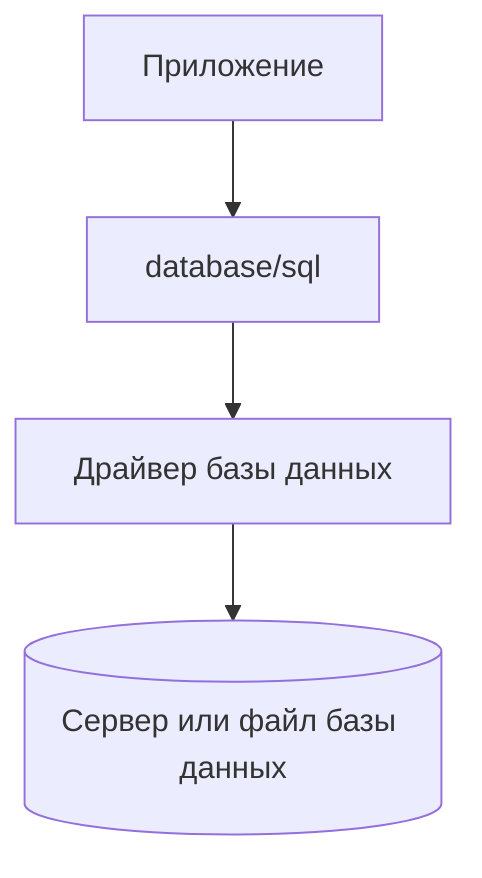

# Как устроена работа с SQL-базами

Пакет [`database/sql`](https://pkg.go.dev/database/sql) — стандартный слой Go для работы с SQL-базами данных. Он не реализует сетевые протоколы серверных СУБД, не интегрируется напрямую со встраиваемыми движками вроде SQLite и не переводит один SQL-диалект в другой. Его задача — дать Go-приложению общий способ выполнять операции через подходящий драйвер.

SQL-запросы при этом остаются явными. Приложение формирует запрос и его параметры, база данных выполняет его, а `database/sql` координирует работу между прикладным кодом и драйвером.

## Роль `database/sql`

Основная ценность пакета — единая модель работы с подключением, запросами, результатами и транзакциями. Эта модель не зависит от способа взаимодействия с конкретной СУБД, поэтому прикладному коду не нужно самостоятельно реализовывать обмен данными с сервером или встраиваемым движком.

На этом этапе достаточно познакомиться с одним типом: [`*sql.DB`](https://pkg.go.dev/database/sql#DB). Это основная точка входа и управляющий объект с пулом соединений. Несмотря на название, `*sql.DB` не представляет ни саму базу данных, ни одно физическое соединение. Стандартная практика — создавать один глобальный экземпляр `*sql.DB` для всего приложения, сохраняя его активным в течение полного жизненного цикла процесса.

Остальные типы пакета связаны с конкретными операциями: выполнением запросов, чтением результатов, транзакциями, подготовленными запросами и выделенными соединениями. Они будут вводиться по мере необходимости, с детальным разбором их роли и жизненного цикла.

## Границы ответственности

Пакет `database/sql` не умеет подключаться к конкретной СУБД. Для этого нужен драйвер — отдельный Go-пакет, который реализует сетевой протокол серверной базы либо интеграцию со встраиваемым движком. Он также знает формат подключения и правила преобразования значений между Go и СУБД.

Упрощённо взаимодействие выглядит так:

У каждого слоя своя зона ответственности:

| Слой | За что отвечает |
| :--- | :--- |
| Приложение | Формирует SQL, передаёт аргументы, выбирает границы транзакций и интерпретирует результат в терминах своей предметной области. |
| `database/sql` | Управляет пулом соединений, координирует операции и передаёт работу выбранному драйверу. |
| Драйвер | Устанавливает соединение, кодирует запрос и параметры, читает ответ базы и преобразует полученные значения и ошибки. |
| База данных | Выполняет SQL, хранит данные, проверяет ограничения и возвращает результат. |

Когда приложение выполняет операцию, `database/sql` получает подходящее соединение из пула и передаёт запрос драйверу. Драйвер отправляет его базе данных и преобразует ответ в форму, понятную стандартному пакету. Затем соединение можно использовать для следующих операций.

При этом `database/sql` не анализирует запрос как SQL-программу, не проверяет существование таблиц и не исправляет синтаксис. Эти задачи остаются за приложением и базой данных.

::: info
Список реализации драйверов для разных СУБД собран на странице Go Wiki [SQL Database Drivers](https://go.dev/wiki/SQLDrivers). Регистрация выбранного драйвера, создание `*sql.DB`, строка подключения и проверка доступности базы рассматриваются в статье [Подключение к базе данных](/ru/database-sql/intro/connection).
:::

## Общий API не означает переносимость

Независимо от выбранного драйвера приложение начинает работу с общей точкой входа `*sql.DB`, а `database/sql` координирует работу с пулом соединений, запросами, результатами и транзакциями. Однако общий способ взаимодействия из Go-кода не делает разные базы данных взаимозаменяемыми и не скрывает различия самих СУБД.

| Область | Что остаётся специфичным |
| :--- | :--- |
| SQL-диалект | Синтаксис запросов, placeholder-параметры и доступные конструкции SQL. |
| Подключение | Формат DSN, TLS, способы аутентификации и параметры драйвера. |
| Типы данных | Представление времени, JSON, массивов, UUID и других типов при обмене с Go. |
| Ошибки | Коды и структуры ошибок ограничений, сети и протокола. |
| Поведение базы | Поддерживаемые возможности, семантика транзакций и конкурентного доступа. |

Поэтому `database/sql` стоит воспринимать как общий контракт для взаимодействия с SQL-базой, а не как слой полной переносимости. При смене СУБД общий подход к организации Go-кода может сохраниться, но запросы, конфигурацию, типы и обработку ошибок всё равно потребуется пересмотреть.
