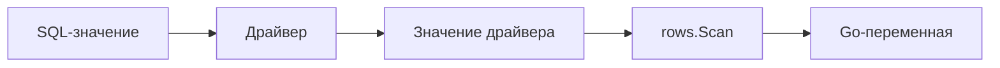

# Преобразование SQL-значений в Go-типы

Методы [`Rows.Scan`](https://pkg.go.dev/database/sql#Rows.Scan) и [`Row.Scan`](https://pkg.go.dev/database/sql#Row.Scan) копируют значения из результата SQL-запроса в Go-переменные. Для каждой выбранной колонки нужно передать адрес подходящей переменной, а порядок аргументов `Scan` должен совпадать с порядком колонок в `SELECT`.

Для обычных строк, чисел и логических значений это выглядит просто. Основные сложности появляются, когда колонка может содержать `NULL`, драйвер возвращает значение в неожиданном представлении или Go-тип не способен сохранить его без потери данных.

## Путь значения от базы до Go

База данных не передаёт в приложение готовые Go-типы. Драйвер читает результат в формате конкретной СУБД и предоставляет `database/sql` одно из поддерживаемых представлений: например, `int64`, `float64`, `bool`, `string`, `[]byte`, `time.Time` или `nil` для SQL `NULL`.

Затем `Scan` пытается преобразовать это значение в тип переменной, переданной приложением:



Поэтому поведение зависит сразу от трёх вещей:

- типа колонки и выражения в SQL;
- представления, выбранного драйвером;
- типа Go-переменной, переданной в `Scan`.

`database/sql` умеет выполнять ряд безопасных преобразований. Например, строковое представление целого числа можно прочитать в `int64`, если значение корректно и помещается в диапазон типа. Если преобразование невозможно или приводит к переполнению, `Scan` возвращает ошибку.

## Базовые соответствия типов

Для колонок с ограничением `NOT NULL` обычно используются следующие Go-типы:

| Значение в SQL | Обычный Go-тип |
| :--- | :--- |
| Целое число | `int64`, иногда `int` |
| Число с плавающей точкой | `float64` |
| Логическое значение | `bool` |
| Текст | `string`, иногда `[]byte` |
| Бинарные данные | `[]byte` |
| Дата и время | `time.Time` |

Простой запрос без колонок, допускающих `NULL`, можно прочитать прямо в структуру:

```go
type UserRecord struct {
    ID        int64
    Email     string
    Active    bool
    CreatedAt time.Time
}

var user UserRecord

err := db.QueryRowContext(ctx, `
    SELECT id, email, active, created_at
    FROM users
    WHERE id = $1
`, userID).Scan(
    &user.ID,
    &user.Email,
    &user.Active,
    &user.CreatedAt,
)
if err != nil {
    return UserRecord{}, fmt.Errorf("scan user: %w", err)
}
```

Этот код корректен, если все четыре колонки возвращают значения, совместимые с выбранными Go-типами. Если, например, `email` может быть `NULL`, для него потребуется другой тип назначения.

::: warning
Не используйте `float64` для денег только потому, что `Scan` умеет читать в него числовые значения. Двоичное представление числа с плавающей точкой может потерять десятичную точность. Выбор представления для `DECIMAL` или `NUMERIC` зависит от требований приложения и возможностей драйвера.
:::

## Представление `NULL` в Go

SQL `NULL` означает отсутствие значения. Это отличается от нулевых значений Go.

Если колонку, допускающую `NULL`, прочитать в обычный `string`, `int64`, `bool` или `time.Time`, при значении `NULL` метод `Scan` вернёт ошибку:

```go
var displayName string

err := db.QueryRowContext(ctx, `
    SELECT display_name
    FROM users
    WHERE id = $1
`, userID).Scan(&displayName)
```

Этот код работает, пока `display_name` содержит строку, но завершится ошибкой, когда база данных вернёт `NULL`.

Значение `NULL` может появиться не только в колонке без ограничения `NOT NULL`. Например, правая сторона `LEFT JOIN` возвращает `NULL`, если связанная строка не найдена, а некоторые агрегатные функции возвращают `NULL` для пустого набора.

Есть три распространённых способа обработать отсутствие значения:

1. Использовать типы `sql.Null*` или обобщённый `sql.Null[T]`.
2. Сканировать значение в указатель, например `*string` или `*time.Time`.
3. Преобразовать `NULL` в SQL через `COALESCE`, если потеря различия допустима по смыслу.

Пример с `COALESCE`:

```go
var displayName string

err := db.QueryRowContext(ctx, `
    SELECT COALESCE(display_name, '')
    FROM users
    WHERE id = $1
`, userID).Scan(&displayName)
if err != nil {
    return fmt.Errorf("scan display name: %w", err)
}
```

Теперь `NULL` превращается в пустую строку до вызова `Scan`.

Используйте `COALESCE` только тогда, когда `NULL` и нулевое значение действительно означают одно и то же для приложения. После такого преобразования отличить «значение отсутствовало» от «в базе хранилась пустая строка» уже нельзя.

### Типы `sql.Null*`

Пакет содержит готовые структуры для распространённых значений, допускающих `NULL`:

| Тип | Поле со значением |
| :--- | :--- |
| [`sql.NullString`](https://pkg.go.dev/database/sql#NullString) | `String string` |
| [`sql.NullInt64`](https://pkg.go.dev/database/sql#NullInt64) | `Int64 int64` |
| [`sql.NullBool`](https://pkg.go.dev/database/sql#NullBool) | `Bool bool` |
| [`sql.NullFloat64`](https://pkg.go.dev/database/sql#NullFloat64) | `Float64 float64` |
| [`sql.NullTime`](https://pkg.go.dev/database/sql#NullTime) | `Time time.Time` |

`Valid` равен `true`, если база вернула не `NULL`. Само значение хранится в типоспецифичном поле: например, `String`, `Int64`, `Bool`, `Float64` или `Time`.

```go
type NullableUserRow struct {
    ID          int64
    DisplayName sql.NullString
    ManagerID   sql.NullInt64
    DeletedAt   sql.NullTime
}

var user NullableUserRow

err := db.QueryRowContext(ctx, `
    SELECT id, display_name, manager_id, deleted_at
    FROM users
    WHERE id = $1
`, userID).Scan(
    &user.ID,
    &user.DisplayName,
    &user.ManagerID,
    &user.DeletedAt,
)
if err != nil {
    return NullableUserRow{}, fmt.Errorf("scan user: %w", err)
}
```

После сканирования значение проверяется через `Valid`:

```go
if user.DisplayName.Valid {
    fmt.Println(user.DisplayName.String)
} else {
    fmt.Println("display name is not set")
}
```

Важно проверять `Valid` до использования поля со значением. Если база вернула `NULL`, `String`, `Int64` или `Time` содержит обычное нулевое значение Go.

### Обобщённый тип `sql.Null[T]`

Начиная с Go 1.22, пакет также предоставляет [`sql.Null[T]`](https://pkg.go.dev/database/sql#Null). Он хранит значение в поле `V`, а признак его наличия — в `Valid`:

```go
var (
    displayName sql.Null[string]
    managerID   sql.Null[int64]
    deletedAt   sql.Null[time.Time]
)

err := row.Scan(&displayName, &managerID, &deletedAt)
if err != nil {
    return fmt.Errorf("scan user details: %w", err)
}

if displayName.Valid {
    fmt.Println(displayName.V)
}
```

Обобщённый тип позволяет использовать одну форму для разных значений. Классические `sql.NullString`, `sql.NullInt64` и `sql.NullTime` по-прежнему распространены и иногда понятнее показывают ожидаемый тип прямо в имени.

Тип `T` должен поддерживаться как значение драйвера. `sql.Null[T]` не делает произвольную Go-структуру автоматически совместимой с колонкой базы. Если тип должен сам управлять чтением и записью, это разбирается в следующей статье [Собственные типы данных](/ru/database-sql/queries/custom-data-types).

### Указатели для значений, допускающих `NULL`

Вместо `sql.Null*` и `sql.Null[T]` можно использовать указатели. При сканировании `NULL` указатель останется `nil`, а для существующего значения `Scan` выделит память и запишет значение по адресу.

```go
type UserWithNullableFields struct {
    ID          int64
    DisplayName *string
    ManagerID   *int64
    DeletedAt   *time.Time
}

var user UserWithNullableFields

err := db.QueryRowContext(ctx, `
    SELECT id, display_name, manager_id, deleted_at
    FROM users
    WHERE id = $1
`, userID).Scan(
    &user.ID,
    &user.DisplayName,
    &user.ManagerID,
    &user.DeletedAt,
)
if err != nil {
    return UserWithNullableFields{}, fmt.Errorf("scan user: %w", err)
}
```

В `Scan` передаётся адрес поля-указателя, поэтому выражение `&user.DisplayName` имеет тип `**string`. Это позволяет методу изменить сам указатель: установить его в `nil` для `NULL` или создать `*string` для обычного значения.

Проверка выглядит привычно для Go-кода:

```go
if user.DisplayName != nil {
    fmt.Println(*user.DisplayName)
}
```

У каждого подхода есть свои компромиссы. Универсального выбора нет: важнее использовать один подход последовательно.

## Бинарные данные и `[]byte`

Бинарные колонки обычно сканируют в `[]byte`:

```go
var payload []byte

err := db.QueryRowContext(ctx, `
    SELECT payload
    FROM audit_events
    WHERE id = $1
`, eventID).Scan(&payload)
if err != nil {
    return nil, fmt.Errorf("scan event payload: %w", err)
}
```

При сканировании в `[]byte` пакет сохраняет копию данных, которой владеет вызывающий код. Такой срез можно хранить и изменять после перехода к следующей строке.

Некоторые драйверы также представляют текстовые колонки как `[]byte`. `Scan` обычно умеет преобразовать такое значение в `string`, но точное исходное представление всё равно определяется драйвером.

::: info
Тип [`sql.RawBytes`](https://pkg.go.dev/database/sql#RawBytes) позволяет избежать копирования при чтении `*sql.Rows`, но его данные действительны только до следующего вызова `Next`, `Scan` или `Close`. Использовать `RawBytes` с `Row.Scan` нельзя. Для обычного прикладного кода безопаснее использовать `[]byte`; `RawBytes` нужен только после осознанной оценки времени жизни данных.
:::

Для бинарных данных, допускающих `NULL`, важно решить, нужно ли различать `NULL` и пустой срез. Если различие имеет значение, можно использовать `sql.Null[[]byte]`.

## Дата, время и часовые пояса

Даты и время обычно сканируют в [`time.Time`](https://pkg.go.dev/time#Time), а колонки, допускающие `NULL`, — в [`sql.NullTime`](https://pkg.go.dev/database/sql#NullTime) или `*time.Time`:

```go
var createdAt time.Time

err := db.QueryRowContext(ctx, `
    SELECT created_at
    FROM users
    WHERE id = $1
`, userID).Scan(&createdAt)
if err != nil {
    return fmt.Errorf("scan created_at: %w", err)
}
```

`database/sql` не определяет семантику временной колонки и не выбирает для неё часовой пояс. `Scan` только копирует полученное значение в `time.Time`, сохраняя его `Location`. Пакет не может определить, представляет ли колонка однозначный момент времени, локальные дату и время или только календарную дату.

Если значение является моментом времени, после сканирования его можно представить в UTC:

```go
createdAt = createdAt.UTC()
```

Методы [`UTC`](https://pkg.go.dev/time#Time.UTC) и [`In`](https://pkg.go.dev/time#Time.In) меняют представление уже известного момента, но не сам момент. Они не добавляют временную зону к календарному значению и не восстанавливают потерянную информацию о зоне.

Прямое сканирование в `time.Time` возможно, только если исходное значение совместимо с этим типом. `Scan` не разбирает произвольные строки или `[]byte` с датой: такое значение нужно сначала прочитать как текст и разобрать отдельно.

Таким образом, `database/sql` отвечает за перенос значения в Go-переменную, а выбор семантики колонки, формата и часового пояса остаётся частью схемы базы данных и приложения.
