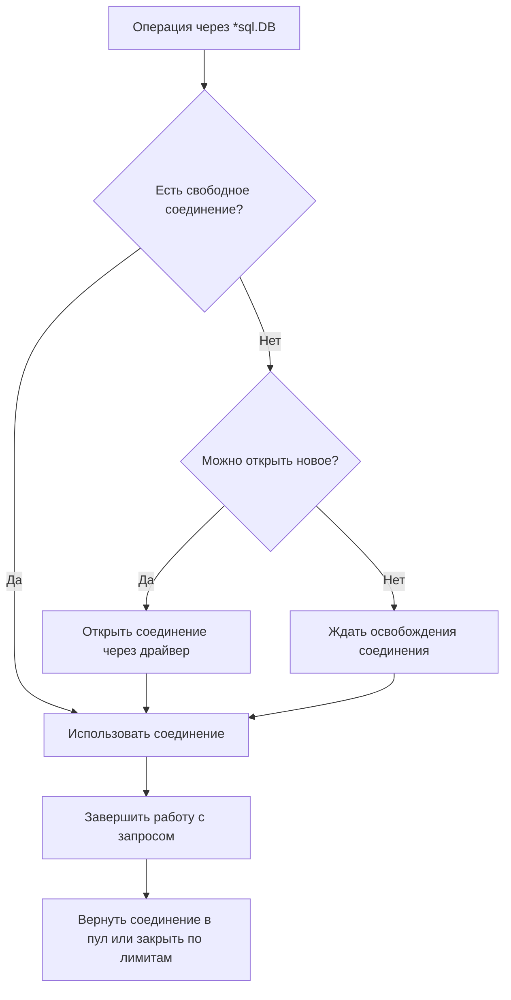

# Пул соединений

[`*sql.DB`](https://pkg.go.dev/database/sql#DB) представляет не одно соединение, а пул, безопасный для конкурентного использования. Когда несколько горутин одновременно выполняют запросы, `database/sql` выдаёт им свободные соединения, при необходимости открывает новые, а после завершения работы возвращает соединения в пул.

Пул позволяет переиспользовать уже установленные соединения и ограничивать нагрузку на базу данных. Но его настройки должны учитывать число экземпляров приложения, лимит соединений на стороне СУБД и реальную параллельность запросов. Слишком маленький пул создаёт очередь внутри приложения, а слишком большой может перегрузить базу данных.

## Как работает пул

Пул создаёт соединения по мере необходимости. Сам вызов `sql.Open` обычно не устанавливает их заранее. Первое соединение может появиться при `PingContext`, `ExecContext`, `QueryContext` или другой операции, которой действительно нужен доступ к базе.

Для каждого запроса `database/sql` проходит упрощённый путь:



Соединение возвращается в пул не всегда сразу после получения ответа. Его могут продолжать удерживать:

- открытый [`*sql.Rows`](https://pkg.go.dev/database/sql#Rows), пока строки не дочитаны или не вызван `Close`;
- незавершённый [`*sql.Tx`](https://pkg.go.dev/database/sql#Tx) до `Commit` или `Rollback`;
- выделенный [`*sql.Conn`](/ru/database-sql/connections/dedicated-connection) до `Conn.Close`.

::: warning
Создавайте один `*sql.DB` на конфигурацию подключения и переиспользуйте его между запросами. Если каждый HTTP-обработчик или компонент доступа к данным создаёт собственный `*sql.DB`, приложение получает несколько независимых пулов и теряет общий контроль над числом соединений.
:::

## Лимит открытых соединений (`SetMaxOpenConns`)

Метод [`db.SetMaxOpenConns`](https://pkg.go.dev/database/sql#DB.SetMaxOpenConns) ограничивает общее число открытых соединений. В лимит входят и занятые, и свободные соединения:

```go
db.SetMaxOpenConns(maxOpenConns)
```

Значение `n <= 0` отключает ограничение. По умолчанию `MaxOpenConns` равен `0`.

## Лимит свободных соединений (`SetMaxIdleConns`)

Метод [`db.SetMaxIdleConns`](https://pkg.go.dev/database/sql#DB.SetMaxIdleConns) задаёт максимальное число свободных соединений, которые пул сохраняет для следующих запросов:

```go
db.SetMaxIdleConns(maxIdleConns)
```

Свободное соединение уже установлено, но сейчас не обслуживает запрос. Его повторное использование обычно дешевле, чем открытие нового соединения с установкой сетевого подключения, аутентификацией и настройкой сессии.

Если `n <= 0`, пул не сохраняет свободные соединения. Текущая документация Go указывает значение по умолчанию `2`, но отдельно предупреждает, что оно может измениться. Если поведение важно для приложения, задавайте лимит явно.

`MaxIdleConns` не может фактически превышать положительный `MaxOpenConns`. Если указать большее значение, `database/sql` уменьшит лимит свободных соединений до общего лимита открытых соединений.

## Ограничение возраста соединения (`SetConnMaxLifetime`)

Метод [`db.SetConnMaxLifetime`](https://pkg.go.dev/database/sql#DB.SetConnMaxLifetime) ограничивает полный возраст соединения с момента его создания:

```go
db.SetConnMaxLifetime(connMaxLifetime)
```

Когда возраст превышает лимит, соединение больше не должно использоваться для новых операций и будет закрыто пакетом. Закрытие может происходить не точно в момент истечения времени, а позже, когда соединение вернётся в пул или будет проверяться перед повторным использованием.

Значение `d <= 0` отключает закрытие по возрасту. Слишком короткое время жизни вызывает постоянные переподключения и увеличивает нагрузку на драйвер, сеть и базу данных.

::: info
`SetConnMaxLifetime` не является тайм-аутом SQL-запроса. Он не должен прерывать уже выполняющуюся операцию только потому, что соединение достигло максимального возраста. Для ограничения запроса используйте контекст.
:::

## Ограничение времени простоя (`SetConnMaxIdleTime`)

Метод [`db.SetConnMaxIdleTime`](https://pkg.go.dev/database/sql#DB.SetConnMaxIdleTime) ограничивает непрерывное время, которое соединение может провести без работы:

```go
db.SetConnMaxIdleTime(connMaxIdleTime)
```

Значение `d <= 0` отключает закрытие по времени простоя. Как и для `SetConnMaxLifetime`, истёкшие соединения могут закрываться позже, а не ровно в момент достижения лимита.

`ConnMaxLifetime` и `ConnMaxIdleTime` отвечают на разные вопросы:

| Настройка | Что измеряется | Когда соединение становится кандидатом на закрытие |
| :--- | :--- | :--- |
| `ConnMaxLifetime` | Полный возраст соединения | Возраст превысил лимит, даже если соединение регулярно использовалось. |
| `ConnMaxIdleTime` | Непрерывное время без работы | Соединение слишком долго оставалось свободным. |

Часто эти настройки применяются вместе: `ConnMaxLifetime` обновляет соединения независимо от активности, а `ConnMaxIdleTime` освобождает лишние соединения после снижения нагрузки.

## Как выбрать начальные настройки

Сначала определите не «идеальный размер пула», а безопасный верхний бюджет. Из лимита СУБД нужно заранее вычесть резерв для администрирования и миграций, а также соединения других приложений. Оставшийся бюджет конкретного сервиса делится на максимальное число одновременно работающих экземпляров:

```text
serviceBudget = databaseLimit - reserve - otherConsumers
perInstanceCeiling = serviceBudget / maxSimultaneousInstances
```

Используйте верхнюю границу автомасштабирования, а не текущее число экземпляров. Если один процесс создаёт несколько `*sql.DB`, сумма их `MaxOpenConns` должна укладываться в рассчитанный потолок. Например, при бюджете сервиса 80 соединений и максимуме в 4 экземпляра каждый экземпляр может получить не более 20 соединений суммарно.

`MaxOpenConns` — это потолок, а не цель постоянно держать столько соединений. Начать можно с меньшего значения, соответствующего ожидаемому числу одновременно выполняемых операций с базой, а затем проверить его под реалистичной нагрузкой. Для `MaxIdleConns` стартовой эвристикой служит меньшее из `MaxOpenConns` и обычного, а не пикового числа одновременных операций. Слишком маленький лимит свободных соединений вызывает частые переподключения, слишком большой без необходимости занимает бюджет базы.

Не назначайте `ConnMaxLifetime` и `ConnMaxIdleTime` произвольными «стандартными» числами. Если прокси-сервер, балансировщик или СУБД ограничивает полный возраст соединения, `ConnMaxLifetime` можно задать немного короче этого срока. `ConnMaxIdleTime` выбирают относительно внешнего ограничения простоя или желаемого времени освобождения лишних соединений. Если таких требований нет, оба ограничения можно оставить выключенными. После настройки проверьте, не вызывают ли выбранные значения частые массовые переподключения.

::: warning
Расчёт задаёт только безопасную границу. Он не доказывает, что база выдержит столько одновременных запросов: итоговый лимит подтверждают нагрузочными тестами и метриками самой СУБД.
:::

## Состояние и статистика пула (`DB.Stats`)

Метод [`db.Stats`](https://pkg.go.dev/database/sql#DB.Stats) возвращает снимок [`sql.DBStats`](https://pkg.go.dev/database/sql#DBStats). Он не выполняет запрос к базе данных и описывает состояние пула внутри текущего Go-процесса.

```go
stats := db.Stats()

slog.Info("database pool",
    "max_open", stats.MaxOpenConnections,
    "open", stats.OpenConnections,
    "in_use", stats.InUse,
    "idle", stats.Idle,
    "wait_count", stats.WaitCount,
    "wait_duration", stats.WaitDuration,
    "max_idle_closed", stats.MaxIdleClosed,
    "max_idle_time_closed", stats.MaxIdleTimeClosed,
    "max_lifetime_closed", stats.MaxLifetimeClosed,
)
```

Поля делятся на текущее состояние и накопительные счётчики:

| Поле | Значение |
| :--- | :--- |
| `MaxOpenConnections` | Текущий лимит открытых соединений. Ноль означает отсутствие лимита. |
| `OpenConnections` | Все установленные соединения: занятые и свободные. |
| `InUse` | Соединения, которые сейчас используются запросами, транзакциями, `Rows` или `Conn`. |
| `Idle` | Свободные соединения, готовые к повторному использованию. |
| `WaitCount` | Сколько раз операциям пришлось ждать соединение. |
| `WaitDuration` | Суммарное время ожидания соединений. |
| `MaxIdleClosed` | Сколько соединений закрыто из-за превышения `MaxIdleConns`. |
| `MaxIdleTimeClosed` | Сколько соединений закрыто из-за `ConnMaxIdleTime`. |
| `MaxLifetimeClosed` | Сколько соединений закрыто из-за `ConnMaxLifetime`. |

Для одного снимка выполняется соотношение:

```text
OpenConnections = InUse + Idle
```

`WaitCount`, `WaitDuration` и счётчики закрытий растут с начала жизни `*sql.DB`. Для мониторинга важнее смотреть, насколько они изменились за интервал, а не сравнивать их абсолютное значение с фиксированным порогом.

## Диагностика по `DB.Stats`

Один снимок редко объясняет проблему. Регулярно экспортируйте `DB.Stats` как метрики, сравнивайте значения за одинаковые интервалы и рассматривайте их вместе с задержкой запросов, ошибками и нагрузкой на сервер базы данных:

| Наблюдение | Что проверить |
| :--- | :--- |
| Растут `WaitCount` и `WaitDuration`, а `InUse` близок к положительному `MaxOpenConnections` | Операции стоят в очереди пула. Сначала ищите медленные запросы и незакрытые `Rows`, `Tx` или `Conn`; затем проверяйте, есть ли у СУБД запас для повышения лимита. |
| Задержка растёт, но счётчики ожидания не меняются и `InUse` ниже лимита | Узким местом, вероятно, является не выдача соединения из пула. Проверяйте SQL, блокировки, сеть и саму базу. |
| Быстро растёт `MaxIdleClosed` одновременно с частыми новыми подключениями | `MaxIdleConns` может быть слишком мал для обычной нагрузки. |
| Быстро растут `MaxIdleTimeClosed` или `MaxLifetimeClosed` и заметны частые переподключения | Возможно, соответствующие интервалы слишком короткие. Сам по себе рост этих счётчиков ожидаем, если лимиты настроены. |
| `InUse` долго не снижается после спада нагрузки | Ищите долгие операции, недочитанные `Rows`, незавершённые транзакции и удерживаемые `Conn`. |

Настраивайте пул итеративно: зафиксируйте исходные метрики, измените один параметр, повторите одинаковую нагрузку и проверьте влияние как на приложение, так и на СУБД. Повышайте `MaxOpenConns` только внутри рассчитанного бюджета соединений.
