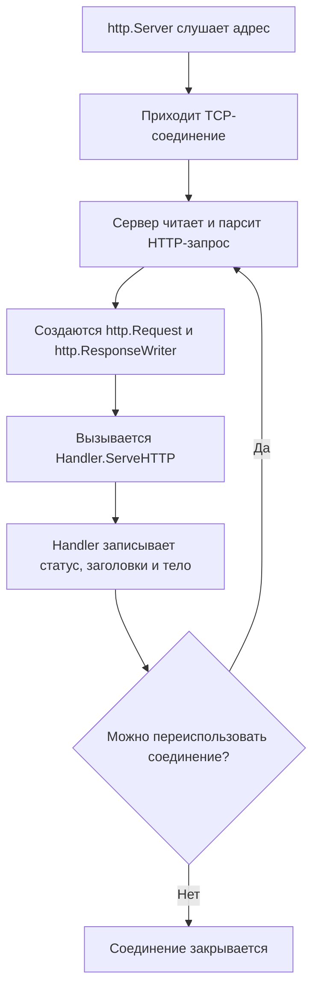

# Жизненный цикл соединения

Пакет [`net/http`](https://pkg.go.dev/net/http) скрывает большую часть сетевых деталей: приложение обычно не читает TCP-сокет напрямую и не собирает HTTP-сообщение вручную. Но обработчик (*handler*) всё равно работает в рамках конкретного запроса, ответа и соединения. Эта модель помогает понимать, когда создаётся [`http.Request`](https://pkg.go.dev/net/http#Request), кто управляет [`http.ResponseWriter`](https://pkg.go.dev/net/http#ResponseWriter), почему важен порядок записи ответа и что происходит после возврата из обработчика.

## Путь запроса

HTTP-сервер в Go принимает TCP-соединения, читает из них HTTP-запросы и для каждого запроса вызывает подходящий обработчик ([`http.Handler`](https://pkg.go.dev/net/http#Handler)).



### 1. Приём соединения

Когда запускается сервер, `net/http` создаёт сетевой listener на указанном адресе. Упрощённо внутренний цикл сервера можно представить так:

```go
for {
    conn, err := listener.Accept()
    if err != nil {
        return err
    }

    go serveConnection(conn)
}
```

### 2. Обработка соединения в горутине

Для HTTP/1.x стандартный сервер Go обычно обрабатывает каждое принятое соединение в отдельной горутине. Это означает, что медленный клиент или долгий запрос на одном соединении не блокирует приём и обработку других соединений.

::: info
Важно не путать эту модель с правилом «одна горутина на каждый запрос» как универсальным описанием всех протоколов. Для HTTP/1.1 несколько запросов могут последовательно пройти через одно и то же keep-alive соединение. Для HTTP/2 несколько запросов могут одновременно идти как независимые потоки внутри одного TCP-соединения.
:::

### 3. Чтение HTTP-запроса

После принятия соединения сервер читает байты из сокета и разбирает HTTP-сообщение:

- request line: метод, путь, версия протокола;
- заголовки;
- поток тела запроса, если оно есть;
- служебные признаки соединения: `Content-Length`, `Transfer-Encoding`, `Connection`.

На основе этих данных создаётся структура [`http.Request`](https://pkg.go.dev/net/http#Request). Именно эту структуру обработчик получает вторым аргументом.

### 4. Передача Request и ResponseWriter

К моменту вызова обработчика запрос уже разобран, но ответ ещё не сформирован. Поэтому сервер передаёт в `ServeHTTP` два значения:

- `http.ResponseWriter` — интерфейс, через который обработчик записывает статус, заголовки и тело ответа;
- `*http.Request` — указатель на структуру с данными входящего запроса: методом, URL, заголовками, телом и контекстом.

::: info
Важно не путать `ResponseWriter` с готовым [`http.Response`](/ru/net-http/intro/response). `ResponseWriter` — это интерфейс записи ответа на стороне сервера, а `http.Response` — структура уже полученного ответа, которую чаще видит HTTP-клиент или тест.
:::

### 5. Вызов обработчика

После подготовки `ResponseWriter` и `Request` сервер передаёт управление выбранному обработчику. Обработчик — это часть программы, которая решает, что делать с конкретным HTTP-запросом: проверить метод, прочитать данные, обратиться к сервисам и записать ответ.

В `net/http` стандартная форма такого вызова выглядит так:

```go
handler.ServeHTTP(w, r)
```

::: info
Метод [`ServeHTTP`](https://pkg.go.dev/net/http#Handler.ServeHTTP) — это точка входа обработчика. Подробно этот контракт разбирается в следующей статье [`Интерфейс http.Handler`](/ru/net-http/intro/handler). Пока важно понимать главное: сервер даёт обработчику запрос и инструмент для записи ответа, а обработчик выполняет прикладную логику.
:::

После возврата из `ServeHTTP` писать в тот же `ResponseWriter` нельзя. Если ответ передается потоково, обработчик должен сам управлять этим циклом и завершить его до возврата.

::: warning
`ResponseWriter` привязан к конкретному запросу и его соединению. Не сохраняйте его в глобальные переменные и не используйте после завершения обработчика.
:::

### 6. Запись ответа

Данные, записанные через `ResponseWriter`, превращаются в HTTP-ответ:

```text
HTTP/1.1 200 OK
Content-Type: text/plain
Date: ...

OK
```

`net/http` сам добавляет часть служебных заголовков, управляет буферизацией и записывает результат в сетевое соединение. Обработчик обычно не управляет TCP-сокетом напрямую.

::: info
Если клиент закрыл соединение раньше времени, запись ответа может завершиться ошибкой. В простых учебных примерах ошибка `fmt.Fprintln(w, ...)` часто опускается, но в streaming-сценариях и продакшен коде ошибки записи нужно учитывать.
:::

### 7. Повторное использование соединения

После завершения ответа сервер решает, можно ли оставить соединение открытым для следующего запроса.

Соединение может быть использовано повторно, если:

- протокол и заголовки допускают keep-alive;
- запрос и ответ корректно завершены;
- не истекли таймауты сервера;
- клиент сам не попросил закрыть соединение;
- сервер не находится в процессе shutdown.

Если keep-alive невозможен, соединение закрывается. Если возможно, сервер ждёт следующий запрос на том же соединении и повторяет цикл.

::: info
Для HTTP/1.1 это последовательная модель: следующий запрос на том же соединении обычно обрабатывается после завершения предыдущего ответа. Для HTTP/2 модель другая: несколько независимых потоков (*streams*) могут существовать одновременно внутри одного соединения, но обработчик всё равно видит привычные `*http.Request` и `http.ResponseWriter`.
:::
