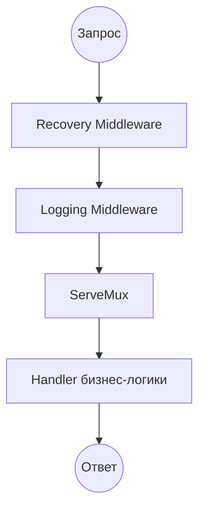

# Интерфейс http.Handler

Интерфейс [`http.Handler`](https://pkg.go.dev/net/http#Handler) — главная абстракция пакета [`net/http`](https://pkg.go.dev/net/http). В архитектуре HTTP-сервера на Go практически все компоненты — от маршрутизатора (*router*) до middleware — строятся вокруг этой абстракции.

## Определение интерфейса

Любой тип, реализующий метод [`ServeHTTP`](https://pkg.go.dev/net/http#Handler.ServeHTTP), становится полноценным веб-компонентом, совместимым с экосистемой стандартной библиотеки.

```go
type Handler interface {
    ServeHTTP(http.ResponseWriter, *http.Request)
}
```

Метод `ServeHTTP` принимает два аргумента: [`http.ResponseWriter`](https://pkg.go.dev/net/http#ResponseWriter) для формирования ответа и [`*http.Request`](https://pkg.go.dev/net/http#Request) с данными входящего запроса. После возврата из `ServeHTTP` обработка запроса считается завершенной.

## Преимущества интерфейсной абстракции

### Композиция компонентов

Компоненты, реализующие `http.Handler`, могут быть вложены друг в друга, формируя цепочки обработки.



::: info
Маршрутизатор [`http.ServeMux`](https://pkg.go.dev/net/http#ServeMux) сам является `http.Handler`. Он сопоставляет URL-адрес каждого входящего запроса со списком зарегистрированных шаблонов (*patterns*) и вызывает наиболее подходящий обработчик.
:::

### Внедрение зависимостей

Реализация интерфейса на структурах позволяет передавать необходимые зависимости, например репозиторий или логгер, напрямую в веб-компонент. Такой подход особенно удобен, когда обработчик связан с несколькими зависимостями, хранит конфигурацию или со временем получает набор вспомогательных методов.

```go
type User struct {
    Name string
}

var ErrUserNotFound = errors.New("user not found")

type UserRepository interface {
    FindByID(id string) (User, error)
}

// ProfileHandler хранит зависимости, необходимые для обработки запроса.
type ProfileHandler struct {
    repo   UserRepository
    logger *log.Logger
}

func (h *ProfileHandler) ServeHTTP(w http.ResponseWriter, r *http.Request) {
    userID := r.URL.Query().Get("id")

    user, err := h.repo.FindByID(userID)
    if err != nil {
        if errors.Is(err, ErrUserNotFound) {
            http.Error(w, "User not found", http.StatusNotFound)
            return
        }

        h.logger.Printf("error finding user %s: %v", userID, err)
        http.Error(w, "Internal Server Error", http.StatusInternalServerError)
        return
    }

    // Обработка ошибки записи ответа опущена.
    fmt.Fprintf(w, "Profile: %s", user.Name)
}
```

::: info
Указатель-получатель (*pointer receiver*) позволяет зарегистрировать один экземпляр `ProfileHandler` и использовать его зависимости во всех вызовах обработчика. Сами зависимости при этом должны быть безопасны для конкурентного использования или синхронизированы внутри своей реализации.
:::

### Изолированное тестирование

Единый интерфейс `http.Handler` упрощает изолированное тестирование: обработчик можно вызвать напрямую, передав ему тестовый запрос и значение, реализующее `http.ResponseWriter`. Для этого стандартная библиотека предоставляет пакет [`net/http/httptest`](https://pkg.go.dev/net/http/httptest).

```go
req := httptest.NewRequest(http.MethodGet, "/?id=67", nil)
w := httptest.NewRecorder()

handler.ServeHTTP(w, req)
```

Паттерны тестирования, проверки статусов, тела ответа и таблицы тестов разбираются в статье [Тестирование обработчиков](/ru/net-http/testing/testing-handlers).

## Конкурентное использование

HTTP-сервер может вызывать один и тот же `http.Handler` конкурентно для разных запросов. Поэтому обработчик должен быть безопасен для одновременного использования несколькими горутинами.

Изменение внутреннего состояния структуры внутри `ServeHTTP` без механизмов синхронизации приводит к состоянию гонки (*data race*) или непредсказуемому поведению.

```go
type SafeHandler struct {
    mu    sync.Mutex
    cache map[string]string
}

func (h *SafeHandler) ServeHTTP(w http.ResponseWriter, r *http.Request) {
    // Один экземпляр обработчика может обслуживать несколько запросов одновременно.
    // Доступ к изменяемому состоянию должен быть синхронизирован.
    h.mu.Lock()
    defer h.mu.Unlock()

    if h.cache == nil {
        h.cache = make(map[string]string)
    }
    h.cache[r.URL.Path] = "visited"
}
```

::: tip
Проектируйте обработчики без внутреннего состояния (*stateless*). Если состояние необходимо и к нему обращаются конкурентно, используйте примитивы синхронизации из пакета [`sync`](https://pkg.go.dev/sync).
:::
