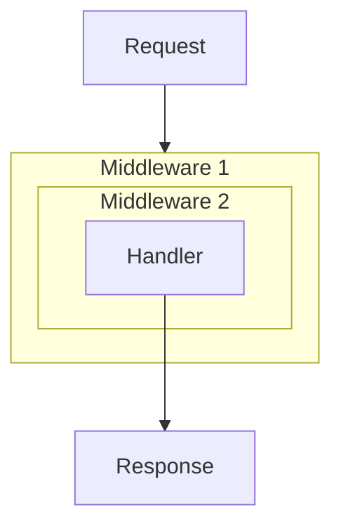

# Middleware

Middleware в Go — это функция, которая принимает [`http.Handler`](https://pkg.go.dev/net/http#Handler) и возвращает новый `http.Handler`. Такой слой может выполнить код до вызова следующего обработчика, после него или прервать цепочку раньше.

```go
func Middleware(next http.Handler) http.Handler {
    return http.HandlerFunc(func(w http.ResponseWriter, r *http.Request) {
        // Код до следующего обработчика.
        next.ServeHTTP(w, r)
        // Код после следующего обработчика.
    })
}
```

## Проектирование

При проектировании middleware полезно учитывать несколько принципов:

1. **Один слой — одна задача:** логирование, авторизация, востановление и CORS проще понимать и тестировать отдельно.
2. **Явное завершение цепочки.** Если middleware сам отправил ответ, он завершает обработку через `return` и не вызывает `next.ServeHTTP`.
3. **Один HTTP-ответ.** После первого `WriteHeader` или `Write` статус уже выбран. Повторная попытка записать другой статус приведет к некорректному поведению или предупреждению в логах сервера.

::: warning
После `http.Error`, `w.WriteHeader` или `w.Write` обычно нужен `return`, если текущий middleware не должен передавать управление дальше.
:::

## Порядок выполнения

Цепочка middleware работает как набор вложенных оберток: запрос проходит слои снаружи внутрь, а код после `next.ServeHTTP` выполняется в обратном порядке.



Порядок слоев влияет на поведение. Recovery middleware (восстановления после `panic`), обычно размещают снаружи, так же как и Logging middleware, чтобы логгировать всю цепочку.

::: warning
Если recovery middleware стоит после logging middleware, паника внутри самого слоя логирования не будет перехвачена.
:::

## Обертка над ResponseWriter

Стандартный интерфейс [`http.ResponseWriter`](https://pkg.go.dev/net/http#ResponseWriter) не позволяет после обработки запроса узнать статус и размер ответа. Для logging и recovery middleware удобно использовать небольшую обертку.

```go
type responseWriter struct {
    http.ResponseWriter
    status      int
    bytes       int
    wroteHeader bool
}

func newResponseWriter(w http.ResponseWriter) *responseWriter {
    return &responseWriter{
        ResponseWriter: w,
        status:         http.StatusOK,
    }
}

func (rw *responseWriter) WriteHeader(code int) {
    if rw.wroteHeader {
        return
    }

    rw.status = code
    rw.wroteHeader = true
    rw.ResponseWriter.WriteHeader(code)
}

func (rw *responseWriter) Write(b []byte) (int, error) {
    if !rw.wroteHeader {
        rw.WriteHeader(http.StatusOK)
    }

    n, err := rw.ResponseWriter.Write(b)
    rw.bytes += n
    return n, err
}

func (rw *responseWriter) Unwrap() http.ResponseWriter {
    return rw.ResponseWriter
}
```

Метод `Write` явно фиксирует неявный статус `200 OK`, а `WriteHeader` игнорирует повторную запись статуса. Поле `bytes` считает фактически записанные байты.

Метод `Unwrap` нужен не для самого логирования, а для совместимости с расширенными возможностями `ResponseWriter`. Например, [`http.ResponseController`](/ru/http/server/responsecontroller) может пройти через такую обёртку к исходному writer и вызвать `Flush`, `Hijack` или методы управления deadline, если они поддерживаются текущим соединением.

## Практические примеры

### 1. Recovery middleware

Перехватывает `panic` в текущей горутине и не дает серверу оборвать соединение без контролируемого ответа. Если ответ уже начал записываться, middleware не пытается отправить новый статус `500`.

```go
func Recovery(next http.Handler) http.Handler {
    return http.HandlerFunc(func(w http.ResponseWriter, r *http.Request) {
        rw := newResponseWriter(w)

        // Использование defer позволяет перехватить панику в текущей горутине.
        defer func() {
            if err := recover(); err != nil {
                log.Printf("panic recovered: %v", err)

                if rw.wroteHeader {
                    return
                }

                http.Error(rw, "Internal Server Error", http.StatusInternalServerError)
            }
        }()

        next.ServeHTTP(rw, r)
    })
}
```

### 2. Logging middleware

Logging middleware использует ту же обертку, чтобы зафиксировать статус, размер ответа и длительность обработки.

```go
func Logging(next http.Handler) http.Handler {
    return http.HandlerFunc(func(w http.ResponseWriter, r *http.Request) {
        start := time.Now()

        requestID := uuid.New().String() // "github.com/google/uuid"
        w.Header().Set("X-Request-ID", requestID)

        rw := newResponseWriter(w)
        next.ServeHTTP(rw, r)

        log.Printf("[%s] %s %s %d %dB %v",
            requestID, r.Method, r.URL.Path, rw.status, rw.bytes, time.Since(start))
    })
}
```

### 3. Auth middleware

Auth middleware показывает short-circuiting — досрочное завершение цепочки без вызова следующего обработчика. При отсутствии токена он отправляет `401` и возвращает управление через `return`.

```go
type contextKey string
const userIDKey contextKey = "user_id"

func Auth(next http.Handler) http.Handler {
    return http.HandlerFunc(func(w http.ResponseWriter, r *http.Request) {
        token := r.Header.Get("Authorization")
        if token == "" {
            http.Error(w, "Unauthorized", http.StatusUnauthorized)
            return
        }

        userID := "user_123"
        ctx := context.WithValue(r.Context(), userIDKey, userID)

        next.ServeHTTP(w, r.WithContext(ctx))
    })
}
```

::: tip
`context.WithValue` не изменяет существующий контекст, а создает новый. Для передачи данных дальше по цепочке используется `r.WithContext(ctx)`.
:::

## Сборка цепочки middleware (Chaining)

При использовании множества middleware вложенные вызовы вида `M1(M2(M3(handler)))` становятся нечитаемыми. Для автоматизации сборки цепочки применяется функция-композитор.

```go
// Chain последовательно оборачивает обработчик в список middleware.
func Chain(h http.Handler, mws ...func(http.Handler) http.Handler) http.Handler {
    for i := len(mws) - 1; i >= 0; i-- {
        h = mws[i](h)
    }
    return h
}

// Пример использования: Chain(handler, M1, M2, M3)
// Recovery -> Logging -> Auth -> finalHandler
handler := Chain(finalHandler, Recovery, Logging, Auth)
```
