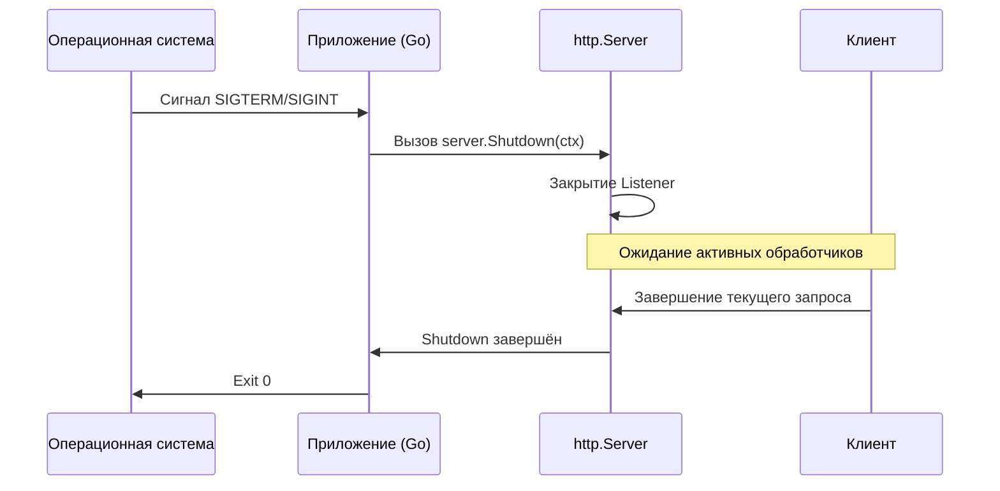

# Graceful Shutdown

**Graceful Shutdown** — это процесс корректного завершения работы сервера, при котором он перестаёт принимать новые запросы, но завершает обработку всех уже поступивших. Это важно для предотвращения потери данных, обрыва активных транзакций и минимизации ошибок `502 Bad Gateway` на стороне балансировщиков нагрузки.

При принудительном завершении процесса (через необработанный сигнал или [`os.Exit`](https://pkg.go.dev/os#Exit)) все активные соединения разрываются мгновенно, а `defer`-вызовы в обработчиках не выполняются.

## Основные методы остановки сервера

Начиная с Go 1.8, структура [`http.Server`](https://pkg.go.dev/net/http#Server) предоставляет два метода для управляемой остановки: [`Shutdown`](https://pkg.go.dev/net/http#Server.Shutdown), [`RegisterOnShutdown`](https://pkg.go.dev/net/http#Server.RegisterOnShutdown).

### Shutdown

Обеспечивает корректное завершение работы сервера без принудительного разрыва активных соединений. Сначала закрываются все открытые порты, затем — неактивные соединения. После этого система ожидает перехода оставшихся активных соединений в неактивное состояние, и только затем сервер полностью завершает работу.

```go
func (srv *Server) Shutdown(ctx context.Context) error
```

### RegisterOnShutdown

Регистрирует функцию-коллбэк, которая вызывается в начале процедуры остановки. Предназначен для запуска протокольно-специфичного завершения соединений, не управляемых методом `Shutdown` напрямую: например, соединений, переведённых в режим Hijack после WebSocket-upgrade.

```go
func (srv *Server) RegisterOnShutdown(f func())
```

## Механизм работы

Процесс остановки через `Shutdown` проходит следующие этапы:

1. Закрываются все открытые слушающие сокеты — новые подключения больше не принимаются.
2. Закрываются все простаивающие (Idle) соединения.
3. Сервер ожидает завершения активных запросов.
4. Если переданный контекст истекает до завершения всех запросов, `Shutdown` возвращает ошибку контекста.



## Реализация

Начиная с Go 1.16, для перехвата сигналов рекомендуется [`signal.NotifyContext`](https://pkg.go.dev/os/signal#NotifyContext) — он интегрируется с контекст-деревом и отменяет контекст при получении сигнала.

```go
package main

import (
    "context"
    "errors"
    "log"
    "net/http"
    "os"
    "os/signal"
    "syscall"
    "time"
)

func main() {
    mux := http.NewServeMux()
    // Регистрация обработчиков...

    srv := &http.Server{
        Addr:    ":8080",
        Handler: mux,
    }

    // signal.NotifyContext отменяет ctx при получении SIGINT или SIGTERM.
    // Вызов stop() освобождает ресурсы и сбрасывает перехват сигналов,
    // поэтому повторный SIGINT прервёт shutdown принудительно.
    ctx, stop := signal.NotifyContext(context.Background(), os.Interrupt, syscall.SIGTERM)
    defer stop()

    // Сервер запускается в горутине, не блокируя main.
    go func() {
        log.Printf("server starting on %s", srv.Addr)
        if err := srv.ListenAndServe(); !errors.Is(err, http.ErrServerClosed) {
            log.Fatalf("listen error: %s", err)
        }
    }()

    // Блокировка до получения сигнала.
    <-ctx.Done()
    stop() // Явный вызов: второй SIGINT теперь завершит процесс немедленно.
    log.Println("shutting down server...")

    // Контекст с таймаутом на остановку.
    shutdownCtx, cancel := context.WithTimeout(context.Background(), 25*time.Second)
    defer cancel()

    if err := srv.Shutdown(shutdownCtx); err != nil {
        // Явный вызов cancel() перед выходом:
        // log.Fatalf вызывает os.Exit и обходит defer.
        cancel()

        log.Fatalf("forced shutdown: %s", err)
    }

    log.Println("server exited gracefully")
}
```

::: tip
[`ListenAndServe`](https://pkg.go.dev/net/http#ListenAndServe) и [`ListenAndServeTLS`](https://pkg.go.dev/net/http#ListenAndServeTLS) всегда возвращают ненулевую ошибку. При штатной остановке через `Shutdown` они вернут [`http.ErrServerClosed`](https://pkg.go.dev/net/http#ErrServerClosed). Проверка через [`errors.Is`](https://pkg.go.dev/net/http#ErrServerClosed) предпочтительнее прямого сравнения (`err != http.ErrServerClosed`), так как корректно обрабатывает обёрнутые ошибки.
:::

## Завершение нестандартных соединений

Метод `Shutdown` не управляет соединениями, переведёнными в режим Hijack. Типичный пример — WebSocket-соединение после HTTP-upgrade: оно больше не находится под управлением `http.Server` как обычный HTTP-запрос.

Для таких соединений `RegisterOnShutdown` позволяет запустить протокольно-специфичное завершение: отправить close frame, закрыть собственные каналы, остановить фоновые горутины. Все зарегистрированные коллбэки вызываются **конкурентно**, а `Shutdown` не ждёт их завершения. Если приложению нужно дождаться cleanup перед выходом из `main`, ожидание нужно организовать отдельно.

```go
package main

import (
    "context"
    "log"
    "net/http"
    "sync"
    "time"

    "github.com/gorilla/websocket"
)

// Hub управляет активными WebSocket-соединениями.
type Hub struct {
    conns map[*websocket.Conn]struct{}
    mu    sync.Mutex
}

func (h *Hub) Register(conn *websocket.Conn) {
    h.mu.Lock()
    h.conns[conn] = struct{}{}
    h.mu.Unlock()
}

func (h *Hub) CloseAll() {
    // Копируем соединения под локом, а закрываем снаружи.
    // conn.Close() может блокироваться (например, при flush буфера),
    // поэтому держать мьютекс во время его вызова значит блокировать
    // закрытие всех остальных соединений.
    h.mu.Lock()
    conns := make([]*websocket.Conn, 0, len(h.conns))
    for conn := range h.conns {
        conns = append(conns, conn)
    }
    h.mu.Unlock()

    for _, conn := range conns {
        conn.Close()
    }
}

func main() {
    hub := &Hub{conns: make(map[*websocket.Conn]struct{})}
    srv := &http.Server{Addr: ":8080"}

    // wg.Add вызывается до RegisterOnShutdown, чтобы исключить гонку с wg.Wait:
    // Shutdown может вызвать коллбэк до того, как main дойдёт до wg.Wait.
    var wg sync.WaitGroup
    wg.Add(1)
    srv.RegisterOnShutdown(func() {
        defer wg.Done()
        hub.CloseAll()
    })

    // ... логика запуска и получения сигнала (см. предыдущий раздел)

    shutdownCtx, cancel := context.WithTimeout(context.Background(), 25*time.Second)
    defer cancel()

    if err := srv.Shutdown(shutdownCtx); err != nil {
        log.Printf("shutdown error: %s", err)
    }

    // Ожидаем завершения cleanup, но не дольше отдельного таймаута.
    done := make(chan struct{})
    go func() {
        wg.Wait()
        close(done)
    }()

    select {
    case <-done:
    case <-time.After(5 * time.Second):
        log.Println("shutdown cleanup timed out")
    }

    log.Println("server exited gracefully")
}
```

::: warning
[`wg.Add`](https://pkg.go.dev/sync#WaitGroup.Add) необходимо вызвать до регистрации коллбэка — так счётчик `WaitGroup` уже увеличен к моменту, когда `Shutdown` сможет запустить этот коллбэк.
:::
