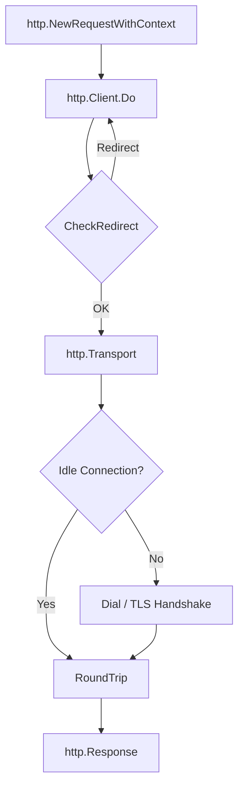

# Формирование и отправка запросов

Создание и отправка HTTP-запроса в Go требует явного управления контекстом и данными. Использование [`http.NewRequestWithContext`](https://pkg.go.dev/net/http#NewRequestWithContext) является стандартом для разработки надежных приложений, так как позволяет контролировать время жизни запроса.

## Жизненный цикл запроса

Перед отправкой запроса важно понимать, как он проходит через слои клиентской части Go.



## Создание запроса

Функция [`http.NewRequestWithContext`](https://pkg.go.dev/net/http#NewRequestWithContext) создает объект [`*http.Request`](https://pkg.go.dev/net/http#Request) с привязанным к нему контекстом.

```go
func NewRequestWithContext(ctx context.Context, method, url string, body io.Reader) (*http.Request, error)
```

| Аргумент | Описание |
| :-- | :-- |
| `ctx` | Контекст запроса. Через него задают timeout/deadline и отмену операции. Не должен быть `nil`; если отдельного контекста нет, используйте `context.Background()` или `context.TODO()`. |
| `method` | HTTP-метод: `http.MethodGet`, `http.MethodPost`, `http.MethodPut` и т.д. Если передать пустую строку, будет использован `GET`, но в прикладном коде лучше указывать метод явно. |
| `url` | URL запроса в виде строки. Некорректный URL вернет ошибку на этапе создания запроса. |
| `body` | Тело запроса как `io.Reader`. Для запросов без тела передают `nil`. |

Она не выполняет сетевой вызов, только собирает описание будущего запроса: метод, URL, заголовки, тело и контекст, через который запрос можно будет отменить. Фактическая отправка начнется позже, когда сформированный запрос будет передан в [`client.Do`](https://pkg.go.dev/net/http#Client.Do).

```go
func fetch(ctx context.Context, client *http.Client, url string) (*http.Response, error) {
    req, err := http.NewRequestWithContext(ctx, http.MethodGet, url, nil)
    if err != nil {
        return nil, fmt.Errorf("create request: %w", err)
    }

    resp, err := client.Do(req)
    if err != nil {
        return nil, fmt.Errorf("execute request: %w", err)
    }

    return resp, nil
}
```

::: warning
Создание запроса тоже может завершиться ошибкой, например если URL некорректный или содержит неподдерживаемую схему. Поэтому ошибку из `NewRequestWithContext` нужно обрабатывать до настройки заголовков и выполнения запроса.
:::

## Управление заголовками

Заголовки запроса доступны через поле [`r.Header`](https://pkg.go.dev/net/http#Header). Библиотека [`net/http`](https://pkg.go.dev/net/http) автоматически канонизирует ключи заголовков (например, `auth-token` станет `Auth-Token`).

| Метод                                                                | Описание                                                 |
| :------------------------------------------------------------------- | :------------------------------------------------------- |
| [`r.Header.Set(key, value)`](https://pkg.go.dev/net/http#Header.Set) | Устанавливает значение, перезаписывая существующее.      |
| [`r.Header.Add(key, value)`](https://pkg.go.dev/net/http#Header.Add) | Добавляет значение к уже существующим для данного ключа. |
| [`r.Header.Get(key)`](https://pkg.go.dev/net/http#Header.Get)        | Возвращает первое значение по ключу.                     |

```go
r.Header.Set("Content-Type", "application/json")
r.Header.Set("Authorization", "Bearer secret-token")
```

## Передача данных (Body)

Тело запроса в `http.Request` представлено интерфейсом [`io.Reader`](https://pkg.go.dev/io#Reader). Это позволяет передавать данные из различных источников без лишней нагрузки на память.

### Отправка JSON

Для отправки JSON-данных наиболее идиоматичным и эффективным способом является прямое кодирование структуры в [`bytes.Buffer`](https://pkg.go.dev/bytes#Buffer) с помощью [`json.Encoder`](https://pkg.go.dev/encoding/json#Encoder). Это позволяет избежать лишней аллокации промежуточного среза байтов, как это происходит при использовании [`json.Marshal`](https://pkg.go.dev/encoding/json#Marshal). 

Кроме того, `http.NewRequestWithContext` автоматически распознает `*bytes.Buffer`, корректно вычислит размер для заголовка `Content-Length` и настроит функцию повторного чтения ([`r.GetBody`](https://pkg.go.dev/net/http#Request.GetBody)) на случай HTTP-редиректов.

```go
type APIClient struct {
    baseURL    string
    httpClient *http.Client
}

type User struct {
    Name string `json:"name"`
}

func (c *APIClient) CreateUser(ctx context.Context, user User) error {
    endpoint := c.baseURL + "/v1/users"

    var buf bytes.Buffer
    if err := json.NewEncoder(&buf).Encode(user); err != nil {
        return fmt.Errorf("encode request body: %w", err)
    }

    req, err := http.NewRequestWithContext(ctx, http.MethodPost, endpoint, &buf)
    if err != nil {
        return fmt.Errorf("create request: %w", err)
    }
    req.Header.Set("Content-Type", "application/json")

    resp, err := c.httpClient.Do(req)
    if err != nil {
        return fmt.Errorf("execute request: %w", err)
    }
    defer resp.Body.Close()

    _, _ = io.Copy(io.Discard, resp.Body)

    if resp.StatusCode != http.StatusCreated {
        return fmt.Errorf("unexpected status: %s", resp.Status)
    }

    return nil
}
```

::: info
После успешного `client.Do(req)` тело ответа нужно закрывать всегда. Если ответ не читается полностью, но соединение желательно вернуть в keep-alive pool, тело обычно дочитывают в `io.Discard`, а затем закрывают: `_, _ = io.Copy(io.Discard, resp.Body)`.
:::
