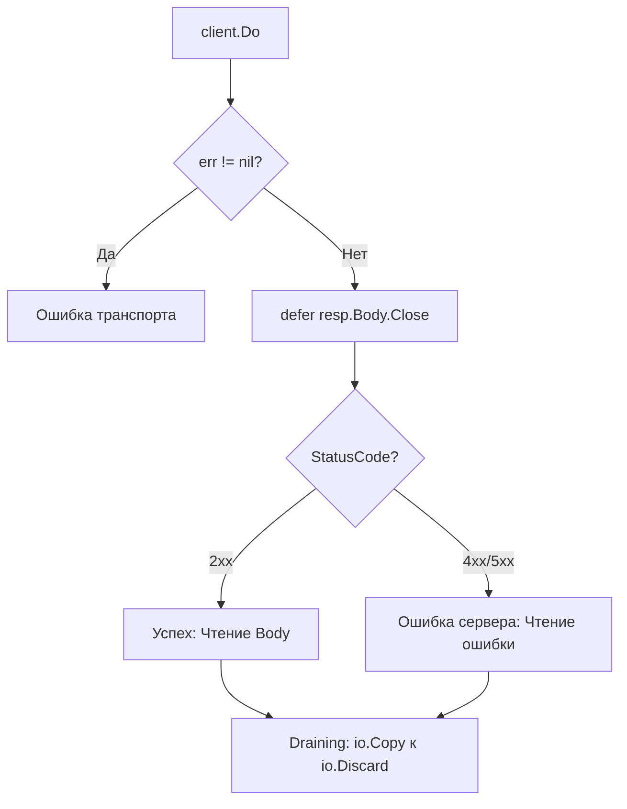

# Чтение и обработка ответов

Результат выполнения HTTP-запроса возвращается в виде структуры [`http.Response`](../intro/response). Правильная обработка ответа критична для стабильности приложения: ошибки в управлении ресурсами (телом ответа) являются основной причиной утечек памяти и файловых дескрипторов.

## Алгоритм обработки

При получении ответа от [`client.Do`](https://pkg.go.dev/net/http#Client.Do) необходимо строго соблюдать последовательность действий.



### 1. Проверка ошибок транспорта

Первым делом проверяется ошибка, возвращаемая методом `Do`. Она указывает на проблемы сетевого уровня: таймауты, ошибки DNS или разрыв соединения. В этом случае `resp` равен `nil`.

```go
resp, err := client.Do(req)
if err != nil {
    // В большинстве случаев обращение к resp.Body здесь приведет к панике.
    return err
}
```

::: info
При классических сетевых ошибках (таймаут, сбой DNS) `resp` всегда равен `nil`. Исключение составляют ошибки политики редиректов (например, кастомный [`CheckRedirect`](https://pkg.go.dev/net/http#Client.CheckRedirect)) — в этом случае `Do` может вернуть ошибку вместе с непустым `resp`, однако его тело ([`resp.Body`](https://pkg.go.dev/net/http#Response.Body)) уже будет автоматически закрыто стандартной библиотекой.
:::

### 2. Закрытие тела (Body)

Если ошибка `nil`, тело ответа **обязательно** должно быть закрыто. Лучшая практика — использование `defer` сразу после проверки ошибки.

```go
defer resp.Body.Close()
```

### 3. Проверка статус-кода

Если транспортных ошибок нет, необходимо проверить логический результат запроса через [`resp.StatusCode`](https://pkg.go.dev/net/http#Response.StatusCode).

```go
if resp.StatusCode != http.StatusOK {
    return fmt.Errorf("unexpected status: %s", resp.Status)
}
```

## Управление ресурсами: Draining Body

Для того чтобы TCP-соединение могло быть возвращено в пул (Keep-Alive) и использовано повторно, тело ответа должно быть вычитано полностью до конца ([`io.EOF`](https://pkg.go.dev/io#EOF)), даже если его содержимое вам не нужно.

```go
func processResponse(resp *http.Response) error {
    defer resp.Body.Close()

    _, err := io.Copy(io.Discard, resp.Body)
    return err
}
```

::: warning
Если тело ответа не закрыто или не вычитано до конца, соединение будет разорвано, и следующее обращение к тому же серверу потребует создания нового TCP/TLS соединения.
:::

## Парсинг данных

Для обработки JSON-ответов рекомендуется использовать [`json.Decoder`](https://pkg.go.dev/encoding/json#Decoder), который работает потоково и эффективнее, чем [`json.Unmarshal`](https://pkg.go.dev/encoding/json#Unmarshal) с предварительным вычитыванием всего тела через [`io.ReadAll`](https://pkg.go.dev/io#ReadAll).

```go
type UserResponse struct {
    ID   int    `json:"id"`
    Name string `json:"name"`
}

var user UserResponse
if err := json.NewDecoder(resp.Body).Decode(&user); err != nil {
    return fmt.Errorf("failed to decode JSON: %w", err)
}
```

## Чтение заголовков

Заголовки ответа доступны через карту [`resp.Header`](https://pkg.go.dev/net/http#Response.Header).

Для большинства одиночных заголовков достаточно метода [`Header.Get`](https://pkg.go.dev/net/http#Header.Get): он приводит имя заголовка к каноническому виду и возвращает первое значение. Если заголовок может встречаться несколько раз, например `Warning` или другие multi-value заголовки, используйте [`Header.Values`](https://pkg.go.dev/net/http#Header.Values) или обращайтесь к срезу значений напрямую.

```go
contentType := resp.Header.Get("Content-Type")
server := resp.Header.Get("Server")
```

Если заголовка нет, `Get` вернет пустую строку. Поэтому когда важно отличить отсутствующий заголовок от пустого значения, проверяйте наличие ключа в `resp.Header`.

```go
values, ok := resp.Header["X-Request-Id"]
if !ok || len(values) == 0 {
    return fmt.Errorf("missing X-Request-Id header")
}

requestID := values[0]
```

## Получение Cookie

Для получения Cookie, установленных сервером в текущем ответе, используйте метод [`resp.Cookies`](https://pkg.go.dev/net/http#Response.Cookies). Он разбирает заголовки `Set-Cookie` и возвращает их как срез структур [`*http.Cookie`](https://pkg.go.dev/net/http#Cookie), чтобы не парсить заголовки вручную.

```go
for _, cookie := range resp.Cookies() {
    fmt.Printf("Cookie: %s = %s\n", cookie.Name, cookie.Value)
}
```

::: warning
`resp.Cookies()` только читает Cookie из конкретного ответа. Если клиент должен автоматически сохранять их и отправлять в следующих запросах, настройте [`http.Client.Jar`](https://pkg.go.dev/net/http#Client) через [`cookiejar`](https://pkg.go.dev/net/http/cookiejar) (см. [Cookie в HTTP-клиенте](./cookies)).
:::
