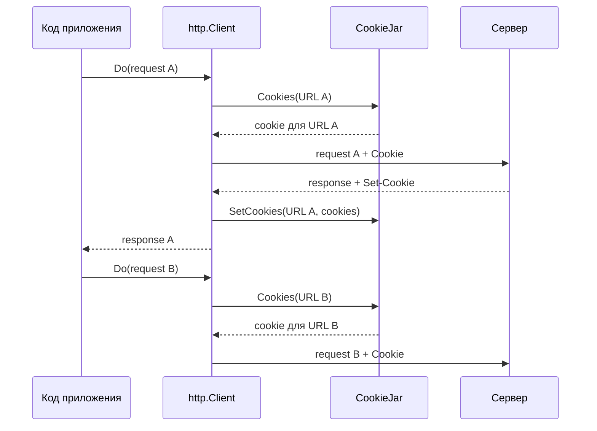

# Cookie в HTTP-клиенте

Cookie в HTTP-клиенте нужны, когда несколько запросов должны разделять состояние: сессию после авторизации, CSRF-токен, пользовательские настройки или другой идентификатор, который сервер передал через заголовок `Set-Cookie`.

Важно разделить три вещи:

| Часть        | Где находится               | Зачем нужна                                                        |
| :----------- | :-------------------------- | :----------------------------------------------------------------- |
| `Set-Cookie` | В ответе сервера            | Сервер просит клиента сохранить cookie.                            |
| `Cookie`     | В следующем запросе клиента | Клиент отправляет ранее сохраненные cookie обратно серверу.        |
| `CookieJar`  | Внутри Go-клиента           | Хранит cookie и решает, какие из них подходят для конкретного URL. |

Сам HTTP не хранит состояние между запросами. Сервер только отправляет инструкцию `Set-Cookie`, а клиент сам решает, сохранить ли ее и когда отправить обратно. В браузере это делает встроенное cookie-хранилище. В Go эту роль выполняет `http.CookieJar`, если он настроен в клиенте.

По умолчанию [`http.Client`](https://pkg.go.dev/net/http#Client) не хранит cookie между запросами. Он отправит cookie только в двух случаях:

- cookie явно добавлены в конкретный [`http.Request`](https://pkg.go.dev/net/http#Request), например через [`req.AddCookie`](https://pkg.go.dev/net/http#Request.AddCookie);
- у клиента настроено поле [`Client.Jar`](https://pkg.go.dev/net/http#Client.Jar), и jar выбрал подходящие cookie для URL запроса.

Первый вариант подходит для разового запроса. Второй нужен для клиента, который должен вести себя как сессионный клиент и автоматически переносить cookie между запросами.

## Интерфейс CookieJar

Поле `http.Client.Jar` имеет тип [`http.CookieJar`](https://pkg.go.dev/net/http#CookieJar):

```go
type CookieJar interface {
    SetCookies(u *url.URL, cookies []*http.Cookie)
    Cookies(u *url.URL) []*http.Cookie
}
```

Методы интерфейса разделяют две операции:

- `SetCookies` сохраняет cookie, которые сервер установил для конкретного URL ответа;
- `Cookies` возвращает cookie, которые можно отправить на конкретный URL запроса.

Готовая реализация находится в пакете [`net/http/cookiejar`](https://pkg.go.dev/net/http/cookiejar). Ее достаточно для большинства клиентов, которым нужно хранить cookie в памяти процесса.

## Цикл выполнения CookieJar

`http.Client` сам связывает ответы сервера с последующими запросами, если в нем есть `CookieJar`.

Перед каждым запросом клиент спрашивает у jar, какие cookie подходят для целевого URL, и добавляет их в заголовок `Cookie`. После получения ответа клиент разбирает заголовки `Set-Cookie` и передает найденные cookie обратно в jar. Так jar постепенно накапливает состояние, а приложение продолжает работать с обычными `client.Do(...)`, не собирая заголовки вручную.

Один цикл выглядит так:

1. Приложение создает и выполняет запрос через `http.Client`.
2. Клиент получает из `CookieJar` cookie для URL запроса.
3. Сервер отвечает и может вернуть один или несколько заголовков `Set-Cookie`.
4. Клиент сохраняет эти cookie в `CookieJar`.
5. Следующий запрос того же клиента получает уже обновленный набор cookie.

Диаграмма ниже показывает этот обмен для двух последовательных запросов:



Важно, что приложение обычно не вызывает `SetCookies` вручную. Этим занимается `http.Client` после получения ответа.

## Настройка клиента

Чтобы включить автоматическую работу с cookie, нужно создать jar и передать его в поле `Jar` у `http.Client`. После этого важно использовать именно этот экземпляр клиента для всех запросов, которые должны разделять одно состояние.

Минимальная настройка выглядит так:

```go
jar, err := cookiejar.New(nil)
if err != nil {
    return fmt.Errorf("create cookie jar: %w", err)
}

client := &http.Client{
    Jar:     jar,
    Timeout: 10 * time.Second,
}
```

Вызов [`cookiejar.New`](https://pkg.go.dev/net/http/cookiejar#New) создает стандартную реализацию `http.CookieJar` из пакета `net/http/cookiejar`:

```go
func New(o *cookiejar.Options) (*cookiejar.Jar, error)
```

::: info
Стандартная реализация всегда возращает nil-ошибку, но сигнатура `cookiejar.New` содержит `error`, поэтому ошибку все равно нужно обрабатывать. Это сохраняет код корректным при будущих изменениях или при замене реализации.
:::

Структура [`cookiejar.Options`](https://pkg.go.dev/net/http/cookiejar#Options) задает политику работы jar. Сейчас у нее есть единственное поле — `PublicSuffixList`, которое помогает jar отличать домены конкретных владельцев от публичных доменных зон вроде `.com`, `.co.uk` или `github.io`.

Если передать значение `nil`, jar будет создан с нулевыми настройками. Такой вариант подходит для простых примеров и тестов, но для клиентов, которые ходят на внешние или пользовательские домены, он является небезопасным. Реализация списка общедоступных суффиксов находится в пакете golang.org/x/net/publicsuffix.

```go
jar, err := cookiejar.New(&cookiejar.Options{
    PublicSuffixList: publicsuffix.List,
})
if err != nil {
    return fmt.Errorf("create cookie jar: %w", err)
}
```

## Как выбираются cookie

`CookieJar` не добавляет все сохраненные cookie в каждый запрос. Для каждого URL он выбирает только те значения, которые подходят по области действия.

Основные ограничения:

| Атрибут              | Что ограничивает                                   |
| :------------------- | :------------------------------------------------- |
| `Domain`             | Хосты, на которые cookie можно отправлять.         |
| `Path`               | Пути URL, для которых cookie считается подходящей. |
| `Secure`             | Отправку только по HTTPS.                          |
| `Expires`, `Max-Age` | Срок жизни cookie.                                 |

::: info
В реализации `CookieJar` из пакета `net/http/cookiejar` localhost и loopback-адреса считаются secure origin, поэтому cookie с атрибутом `Secure` может подходить для локального HTTP-запроса.
:::

Если сервер вернул `Set-Cookie` без `Domain`, cookie привязывается к хосту ответа. Такая cookie не будет отправляться на соседние поддомены.

Если сервер указал `Domain`, jar проверяет, имеет ли сервер право устанавливать cookie для этого домена. Строгость этой проверки зависит от `PublicSuffixList`, переданного при создании jar.

`Path` сужает область действия внутри сайта. Cookie с `Path=/admin` подойдет для `/admin` и `/admin/users`, но не для `/api`.

Например, cookie с такими атрибутами:

```http
Set-Cookie: session=abc; Domain=example.com; Path=/admin; Secure
```

будет отправлена на `https://example.com/admin/users`, но не будет отправлена на `http://example.com/admin/users`, `https://api.other.com/admin/users` или `https://example.com/api`.

::: info
`HttpOnly` и `SameSite` в первую очередь важны для браузеров. Обычный Go-клиент не выполняет JavaScript и не имеет браузерного контекста "same-site" навигации.
:::

## Время жизни и хранение

Стандартный `cookiejar.Jar` хранит cookie в памяти процесса. После перезапуска приложения сохраненное состояние будет потеряно.

Это нормально для короткоживущих клиентов, тестов и сервисов, которые получают новую сессию при старте. Если сессию нужно сохранять между запусками, потребуется собственная реализация `http.CookieJar` или отдельный слой, который будет выгружать и восстанавливать cookie.

## Проверка сохраненных cookie

Метод `Cookies` можно вызвать напрямую, чтобы посмотреть, какие cookie jar выберет для конкретного URL. HTTP-запрос при этом не выполняется.

```go
func printCookies(client *http.Client, rawURL string) error {
    if client.Jar == nil {
        return fmt.Errorf("cookie jar is not configured")
    }

    u, err := url.Parse(rawURL)
    if err != nil {
        return fmt.Errorf("parse URL: %w", err)
    }

    for _, cookie := range client.Jar.Cookies(u) {
        fmt.Printf("%s=%s\n", cookie.Name, cookie.Value)
    }

    return nil
}
```

Такой прием полезен в тестах и при отладке авторизации: можно проверить не только факт получения cookie, но и то, подходит ли она для следующего URL.

## Последовательные запросы

После настройки `Jar` один и тот же клиент можно использовать для цепочки запросов с общим состоянием. Например, первый запрос получает сессию, а второй использует ее при обращении к защищенной странице.

```go
func openDashboard(ctx context.Context, client *http.Client, baseURL string) error {
    loginReq, err := http.NewRequestWithContext(ctx, http.MethodGet, baseURL+"/login", nil)
    if err != nil {
        return fmt.Errorf("create login request: %w", err)
    }

    loginResp, err := client.Do(loginReq)
    if err != nil {
        return fmt.Errorf("execute login request: %w", err)
    }
    defer loginResp.Body.Close()

    if loginResp.StatusCode != http.StatusOK {
        return fmt.Errorf("unexpected login status: %s", loginResp.Status)
    }

    dashboardReq, err := http.NewRequestWithContext(ctx, http.MethodGet, baseURL+"/dashboard", nil)
    if err != nil {
        return fmt.Errorf("create dashboard request: %w", err)
    }

    dashboardResp, err := client.Do(dashboardReq)
    if err != nil {
        return fmt.Errorf("execute dashboard request: %w", err)
    }
    defer dashboardResp.Body.Close()

    if dashboardResp.StatusCode != http.StatusOK {
        return fmt.Errorf("unexpected dashboard status: %s", dashboardResp.Status)
    }

    return nil
}
```

Между этими запросами не нужно вручную читать `Set-Cookie` и собирать заголовок `Cookie`: если сервер установил подходящую cookie на `/login`, `http.Client` передаст ее в `CookieJar`, а затем добавит в запрос к `/dashboard`.

## Cookie и redirect

`CookieJar` участвует и в redirect-цепочках. Если промежуточный ответ `3xx` содержит `Set-Cookie`, клиент обновит jar перед следующим переходом и заново выберет cookie для URL из `Location`.

Типичный поток авторизации выглядит так:

1. Клиент отправляет запрос на `/login`.
2. Сервер отвечает `302 Found` и передает `Set-Cookie`.
3. `http.Client` сохраняет cookie в `Jar`.
4. Клиент переходит на URL из `Location`.
5. Перед новым запросом `Jar` возвращает cookie, если она подходит по домену, пути и схеме.

Если `Jar` равен `nil`, клиент может следовать redirect-переходам, но автоматически сохранять cookie между ними не будет. Подробно redirect-политика `http.Client` разбирается в статье [Redirect в HTTP-клиенте](./redirects).
