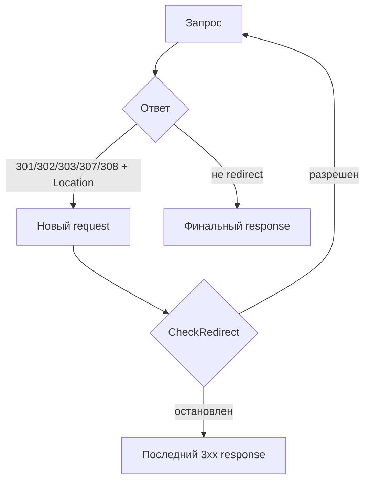

# Redirect в HTTP-клиенте

В контексте [`http.Client`](https://pkg.go.dev/net/http#Client) redirect — это ответ с одним из статусов `301`, `302`, `303`, `307` или `308` и заголовком `Location`. Именно для этих статусов стандартный клиент Go может автоматически выполнить следующий запрос.

Переходы по redirect выполняются на уровне `http.Client`: именно клиент решает, отправлять ли следующий запрос, какие заголовки перенести, как применить cookie и когда остановить цепочку.

[`http.Transport`](https://pkg.go.dev/net/http#Transport) отвечает только за отдельный сетевой [`RoundTrip`](https://pkg.go.dev/net/http#RoundTripper.RoundTrip). Он возвращает ответ как обычный HTTP-ответ и не принимает решение о переходе по `Location`.

## Выполнение redirect-цепочки

По умолчанию `http.Client` автоматически следует за поддерживаемыми redirect-ответами и останавливается после 10 последовательных запросов в одной цепочке. Если сервер создает бесконечную цепочку, клиент возвращает ошибку после достижения этого лимита.

Один переход выглядит так:

1. Клиент выполняет исходный запрос.
2. Сервер возвращает поддерживаемый redirect-статус и заголовок `Location`.
3. `http.Client` создает новый `http.Request` для URL из `Location`.
4. Перед отправкой нового запроса клиент вызывает `CheckRedirect`.
5. Если переход разрешен, клиент выполняет следующий запрос.
6. После завершения цепочки приложение получает финальный ответ.



Промежуточные ответы не возвращаются вызывающему коду, если redirect не остановлен явно. Другие `3xx`-ответы, а также поддерживаемые redirect-статусы без `Location`, не превращаются в следующий запрос автоматически и возвращаются как обычный response.

## Поведение redirect-цепочки

Поведение redirect-цепочки задается через поле [`CheckRedirect`](https://pkg.go.dev/net/http#Client.CheckRedirect) в структуре `http.Client`:

```go
CheckRedirect func(req *http.Request, via []*http.Request) error
```

Функция вызывается перед выполнением следующего запроса:

- `req` — новый запрос, который клиент собирается выполнить по значению заголовка `Location`;
- `via` — предыдущие запросы в текущей цепочке, от самого раннего к самому позднему.

Возвращаемая ошибка управляет дальнейшим поведением:

- `nil` разрешает следующий переход;
- [`http.ErrUseLastResponse`](https://pkg.go.dev/net/http#ErrUseLastResponse) останавливает переходы и возвращает последний ответ `3xx` без ошибки;
- любая другая ошибка прерывает выполнение, а клиент возвращает ее обернутой в [`*url.Error`](https://pkg.go.dev/net/url#Error).

::: info
Если `CheckRedirect` возвращает обычную ошибку, `client.Do` может вернуть непустой `resp`, но тело этого ответа уже будет закрыто стандартной библиотекой. Это исключение из общего правила «при `err != nil` ответ обычно отсутствует».
:::

## Статус и HTTP-метод

Redirect-статус влияет не только на новый URL, но и на метод следующего запроса. Для запросов с телом, например `POST`, это особенно важно.

| Статус | Типичное значение | Поведение `http.Client` |
| :-- | :-- | :-- |
| `301 Moved Permanently` | Ресурс постоянно перенесен | Следующий запрос станет `GET`, кроме исходного `HEAD`. |
| `302 Found` | Временный переход | Следующий запрос станет `GET`, кроме исходного `HEAD`. |
| `303 See Other` | Результат доступен по другому URL | Следующий запрос станет `GET`, кроме исходного `HEAD`. |
| `307 Temporary Redirect` | Временный переход с сохранением метода | Метод сохраняется; body повторяется, если его можно прочитать заново. |
| `308 Permanent Redirect` | Постоянный переход с сохранением метода | Метод сохраняется; body повторяется, если его можно прочитать заново. |

Для `301`, `302` и `303` стандартный клиент меняет метод на `GET`, если исходный запрос не был `HEAD`. Для `307` и `308` метод сохраняется. Если у исходного запроса есть ненулевое body, клиенту нужно уметь повторно прочитать его через [`Request.GetBody`](https://pkg.go.dev/net/http#Request.GetBody).

[`http.NewRequestWithContext`](https://pkg.go.dev/net/http#NewRequestWithContext) автоматически настраивает `Request.GetBody` для некоторых стандартных типов тела, например `*bytes.Buffer`, `*bytes.Reader` и `*strings.Reader`.

::: warning
Если запрос с ненулевым body создан из одноразового потока, например сетевого соединения или файла без настройки повторного чтения, redirect `307` или `308` не будет выполнен автоматически. В этом случае `http.Client` вернет последний `3xx` response вызывающему коду без ошибки.
:::

## Остановка redirect

Иногда приложению нужно самостоятельно обработать ответ `3xx`: прочитать `Location`, сохранить статус-код или принять решение по домену назначения. Для этого `CheckRedirect` должен вернуть `http.ErrUseLastResponse`.

```go
client := &http.Client{
    CheckRedirect: func(req *http.Request, via []*http.Request) error {
        return http.ErrUseLastResponse
    },
}
```

В этом режиме `client.Do` возвращает сам redirect-ответ, а не результат следующего запроса. Тело ответа остается открытым, поэтому его нужно закрыть после обработки.

```go
resp, err := client.Get("http://example.com")
if err != nil {
    return fmt.Errorf("execute request: %w", err)
}
defer resp.Body.Close()

if resp.StatusCode >= 300 && resp.StatusCode < 400 {
    location := resp.Header.Get("Location")
    fmt.Println("redirect location:", location)
}
```

## Лимит redirect-цепочки

Стандартный лимит в 10 последовательных запросов подходит для большинства случаев, но для конкретного клиента его можно ужесточить.

```go
client := &http.Client{
    CheckRedirect: func(req *http.Request, via []*http.Request) error {
        const maxRequestsInChain = 3
        if len(via) >= maxRequestsInChain {
            return fmt.Errorf("redirect chain limit exceeded: %d", maxRequestsInChain)
        }

        return nil
    },
}
```

`via` уже содержит запросы, выполненные в текущей цепочке, поэтому проверка `len(via) >= maxRequestsInChain` запрещает выполнение следующего запроса после достижения лимита. При обычной ошибке `client.Do` вернет ее как часть `*url.Error`.

## Заголовки при redirect

При redirect `http.Client` создает новый `http.Request`. Большинство заголовков исходного запроса переносится автоматически, но чувствительные заголовки обрабатываются осторожнее.

Стандартная библиотека не переносит `Authorization`, `WWW-Authenticate` и `Cookie` на недоверенный домен. Redirect с `example.com` на `api.example.com` считается допустимым переносом, а redirect с `example.com` на `other.example` — нет.

::: warning
Передача учетных данных при redirect на другой домен требует явной проверки целевого хоста. Механическое копирование `Authorization` или `Cookie` в `CheckRedirect` может раскрыть секреты внешнему сервису.
:::

Если прикладной заголовок безопасен для всей redirect-цепочки, его можно перенести вручную.

```go
client := &http.Client{
    CheckRedirect: func(req *http.Request, via []*http.Request) error {
        previous := via[len(via)-1]
        if traceID := previous.Header.Get("X-Trace-ID"); traceID != "" {
            req.Header.Set("X-Trace-ID", traceID)
        }

        return nil
    },
}
```

## Cookie во время redirect

Если у клиента настроен [`Jar`](https://pkg.go.dev/net/http#Client.Jar), `http.Client` применяет его на каждом шаге redirect-цепочки: сначала сохраняет `Set-Cookie` из промежуточного ответа, затем строит новый запрос по `Location` и только после этого выбирает cookie для нового URL.

Ключевая деталь в том, что cookie подбираются не для URL, который вернул redirect, а для URL следующего запроса. Поэтому redirect может изменить набор отправляемых cookie даже внутри одной цепочки. Например, cookie, установленная на `/login`, не обязательно подойдет для `/dashboard`, если ее `Path` слишком узкий. Redirect на другой хост также заново проходит через правила `CookieJar`, поэтому host-only cookie не будет автоматически отправлена на соседний домен.

::: warning
`CookieJar` ограничивает отправку cookie по правилам домена, пути и схемы, но не отвечает за доверенность самого перехода. Если клиент не должен уходить на внешний домен, это нужно проверять в `CheckRedirect`.
:::

Если `Jar` равен `nil`, клиент может следовать redirect-переходам, но не будет сохранять cookie из промежуточных ответов. Явно заданный заголовок `Cookie` остается обычным заголовком запроса: он не обновляется по `Set-Cookie` и не превращается в сессионное состояние клиента.

Для сессионного клиента лучше использовать `CookieJar`, а не переносить `Cookie` вручную внутри `CheckRedirect`. Подробно устройство `CookieJar` и правила выбора cookie разбираются в статье [Cookie в HTTP-клиенте](./cookies).

## Финальный URL

После успешного выполнения redirect-цепочки финальный URL доступен через поле [`resp.Request`](https://pkg.go.dev/net/http#Response.Request). Оно указывает на последний запрос, который привел к полученному ответу.

```go
resp, err := client.Get("http://example.com")
if err != nil {
    return fmt.Errorf("execute request: %w", err)
}
defer resp.Body.Close()

fmt.Println("final URL:", resp.Request.URL.String())
```
