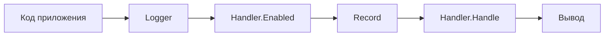
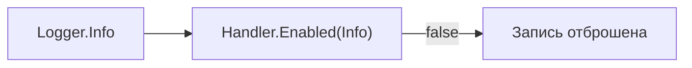

# Как проходит запись

Вызов `logger.Info` не превращает аргументы в готовую строку самостоятельно. Логгер сначала проверяет, нужен ли выбранный уровень, затем формирует запись о событии и передаёт её обработчику.

```go
logger.Info("request completed",
    "method", "GET",
    "route", "/users/{id}",
    "status", 200,
)
```

Для прикладного кода это один вызов, но внутри `log/slog` событие проходит несколько последовательных этапов. Эта модель помогает понять, где применяется порог, откуда берутся служебные поля и какая часть отвечает за текст или JSON.

## Путь события

Общую последовательность можно представить так:



Если `Handler.Enabled` возвращает `false`, цепочка заканчивается раньше и `Record` не создаётся. Если уровень включён, логгер собирает запись и передаёт её в `Handler.Handle`. Дальше обработчик выбирает представление и отправляет результат в настроенный поток или другую систему.

## Роль `Logger`

[`slog.Logger`](https://pkg.go.dev/log/slog#Logger) служит входом для прикладного кода. Метод `Info` получает сообщение и атрибуты, назначает событию уровень `Info` и обращается к связанному обработчику.

Логгер не знает, будет результат текстом, JSON или данными для другой системы. Он отвечает за общую часть события: уровень, время вызова, сообщение, позицию в исходном коде и атрибуты. Представление этих данных остаётся задачей обработчика.

Каждый логгер связан с одним обработчиком, переданным в [`slog.New`](https://pkg.go.dev/log/slog#New). Получить его можно через [`Logger.Handler`](https://pkg.go.dev/log/slog#Logger.Handler), но обычному компоненту приложения это требуется редко: он работает с методами самого логгера.

## Ранняя проверка через `Handler.Enabled`

Перед созданием полной записи логгер вызывает метод `Enabled` интерфейса [`slog.Handler`](https://pkg.go.dev/log/slog#Handler). Обработчик получает уровень события и решает, следует ли продолжать обработку.

При пороге `Warn` вызов `logger.Info` закончится на этом этапе:



Ранняя проверка позволяет не создавать `Record`, не преобразовывать переданные аргументы в атрибуты и не форматировать результат.

## Содержимое `Record`

Если уровень включён, логгер создаёт [`slog.Record`](https://pkg.go.dev/log/slog#Record). Это внутренний контейнер одного события, в котором данные остаются отделены от их будущего представления.

| Часть записи | Содержимое |
| :--- | :--- |
| `Time` | Время вызова метода логгера. |
| `Level` | Уровень `Debug`, `Info`, `Warn`, `Error` или собственное значение. |
| `Message` | Сообщение, например `request completed`. |
| `PC` | Позиция вызова в программе, если она доступна. |
| Атрибуты | Именованные значения `method`, `route`, `status` и другие поля события. |

Поле `PC` хранит служебное значение, по которому обработчик может определить файл и строку вызова. Встроенные обработчики используют его, когда включён вывод позиции исходного кода. Добавлять имя файла в сообщение вручную не требуется.

Атрибуты являются частью `Record`, хотя не представлены открытым полем структуры. Обработчик получает их вместе с остальными данными и решает, как записать каждый ключ и значение.

Обычный прикладной код почти никогда не создаёт и не изменяет `Record` напрямую. Компонент описывает событие через `Logger`, а с готовой записью работают обработчики и обёртки над ними.

## Обработка через `Handler.Handle`

После формирования `Record` логгер вызывает `Handler.Handle`. Метод получает готовое событие и выполняет его окончательную обработку.

Для встроенного `TextHandler` это означает преобразование полей в последовательность `key=value`:

```text
time=2026-07-22T10:15:42.123+02:00 level=INFO msg="request completed" method=GET route=/users/{id} status=200
```

`JSONHandler` получает тот же `Record`, но представляет его как JSON:

```json
{"time":"2026-07-22T10:15:42.123+02:00","level":"INFO","msg":"request completed","method":"GET","route":"/users/{id}","status":200}
```

При смене обработчика вызов `logger.Info` и содержимое события не меняются. Меняется только последняя часть пути — способ обработки и представления записи.

Обработчик не обязан выводить текст самостоятельно. Реализация может передать `Record` другому обработчику, добавить общие поля или отправить событие во внешнюю систему. Эти сценарии используют тот же контракт `Enabled` и `Handle`.

::: info
`Handler.Handle` возвращает ошибку, но методы `Logger.Info`, `Logger.Warn` и остальные её не возвращают: логгер отбрасывает результат `Handle`. Если сбой канала логирования нужно отслеживать, это поведение реализуют внутри обработчика или обёртки над ним.
:::

## Ответственность частей

После полного пути границы между основными частями `log/slog` выглядят так:

| Часть | Ответственность |
| :--- | :--- |
| Прикладной код | Выбирает сообщение, уровень и атрибуты события. |
| `Logger` | Принимает вызов, проверяет уровень и формирует `Record`. |
| `Record` | Переносит данные одного события без привязки к формату. |
| `Handler` | Фильтрует запись, выбирает представление и передаёт результат дальше. |

Эта модель остаётся одинаковой для простого текстового вывода и более сложной обработки. Прикладной код сообщает о событии через `Logger`, а всё, что связано с фильтрацией и дальнейшим представлением, находится по другую сторону `Handler`.
