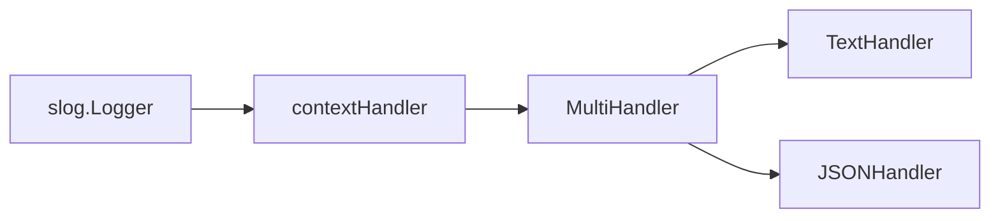

# Обёртки и композиция обработчиков

Для расширения логирования не всегда нужен новый конечный обработчик со своим форматом и приёмником. Часто достаточно обёртки: она выполняет одну дополнительную операцию над [`slog.Record`](https://pkg.go.dev/log/slog#Record), а затем передаёт запись готовому [`slog.TextHandler`](https://pkg.go.dev/log/slog#TextHandler), [`slog.JSONHandler`](https://pkg.go.dev/log/slog#JSONHandler) или другому обработчику.

Несколько обработчиков можно соединять в слои. Например, внешний слой добавляет `request_id`, следующий распределяет событие между двумя получателями, а встроенные обработчики формируют текст и JSON:



Порядок слоёв является частью поведения: обёртка до разветвления меняет все копии события, а обёртка вокруг одного дочернего обработчика влияет только на его вывод.

## Обёртка над готовым обработчиком

Обёртка хранит следующий обработчик и делегирует ему основную работу. При этом она должна явно реализовать все четыре метода интерфейса [`slog.Handler`](https://pkg.go.dev/log/slog#Handler), а не только `Handle`.

Простое встраивание интерфейса легко создаёт ошибку:

```go
type brokenHandler struct {
    slog.Handler
}

func (h *brokenHandler) Handle(
    ctx context.Context,
    record slog.Record,
) error {
    // Дополнительная обработка.
    return h.Handler.Handle(ctx, record)
}
```

Пока используется исходный логгер, переопределённый `Handle` работает. Но `logger.With` вызовет у обёртки унаследованный `WithAttrs`, который вернёт производный внутренний обработчик без `brokenHandler`. После этого дополнительное поведение исчезнет.

Надёжная обёртка делегирует `Enabled`, а результаты `WithAttrs` и `WithGroup` снова помещает в тот же внешний тип.

## Поля из context.Context

Если разные слои приложения используют `InfoContext`, `ErrorContext` и другие методы с контекстом, обёртка может централизованно перенести `request_id` из контекста в атрибут события.

Для значения используется собственный тип ключа и функция доступа:

```go
type requestIDKey struct{}

func withRequestID(
    ctx context.Context,
    requestID string,
) context.Context {
    return context.WithValue(
        ctx,
        requestIDKey{},
        requestID,
    )
}

func requestIDFromContext(ctx context.Context) (string, bool) {
    requestID, ok := ctx.Value(requestIDKey{}).(string)
    return requestID, ok
}
```

Обёртка хранит следующий обработчик:

```go
type contextHandler struct {
    next slog.Handler
}

func NewContextHandler(next slog.Handler) slog.Handler {
    if next == nil {
        panic("nil handler")
    }

    return &contextHandler{next: next}
}
```

Конструктор принимает любой следующий обработчик. Явная проверка `nil` обнаруживает ошибку конфигурации сразу, а не при первом событии.

### Enabled и Handle

Проверка уровня полностью делегируется следующему слою:

```go
func (h *contextHandler) Enabled(
    ctx context.Context,
    level slog.Level,
) bool {
    return h.next.Enabled(ctx, level)
}
```

`Handle` извлекает идентификатор и добавляет его только при наличии непустого значения:

```go
func (h *contextHandler) Handle(
    ctx context.Context,
    record slog.Record,
) error {
    requestID, ok := requestIDFromContext(ctx)
    if !ok || requestID == "" {
        return h.next.Handle(ctx, record)
    }

    record = record.Clone()
    record.AddAttrs(
        slog.String("request_id", requestID),
    )

    return h.next.Handle(ctx, record)
}
```

Перед изменением вызывается [`Record.Clone`](https://pkg.go.dev/log/slog#Record.Clone), потому что обычная копия `Record` может разделять внутреннее хранилище атрибутов с исходной записью. Если идентификатора нет, обёртка сразу делегирует вызов и не выполняет лишнее клонирование.

Отмена контекста не запрещает запись. `Handle` использует `ctx` только для чтения значения, связанного с запросом, а затем передаёт тот же контекст следующему слою.

### WithAttrs и WithGroup

Производные обработчики снова оборачиваются в `contextHandler`:

```go
func (h *contextHandler) WithAttrs(
    attrs []slog.Attr,
) slog.Handler {
    return &contextHandler{
        next: h.next.WithAttrs(attrs),
    }
}

func (h *contextHandler) WithGroup(
    name string,
) slog.Handler {
    if name == "" {
        return h
    }

    return &contextHandler{
        next: h.next.WithGroup(name),
    }
}
```

Исходная обёртка не изменяется, поэтому базовый и производный логгеры можно использовать одновременно. Семантику групп сохраняет внутренний обработчик: `TextHandler` создаёт составные ключи, а `JSONHandler` — вложенные объекты.

Подключение выполняется один раз при создании логгера:

```go
handler := NewContextHandler(
    slog.NewJSONHandler(os.Stdout, nil),
)
logger := slog.New(handler)

ctx := withRequestID(
    context.Background(),
    "req-7",
)

logger.InfoContext(ctx, "request completed",
    slog.Int("status", http.StatusOK),
)
```

В результате `request_id` становится обычным структурированным полем:

```json
{"time":"2026-07-22T12:00:00Z","level":"INFO","msg":"request completed","status":200,"request_id":"req-7"}
```

Обычный `logger.Info` передаёт обработчику `context.Background()`, поэтому обёртка не сможет получить идентификатор запроса. Автоматическое обогащение работает только для методов, которым передан исходный `ctx`.

::: warning
Не добавляйте `request_id` одновременно через эту обёртку и `logger.With`: в выводе появятся одинаковые ключи. Приложение должно выбрать один способ обогащения для конкретной цепочки логгеров.
:::

## Влияние открытых групп

Атрибут добавляется в `Record` перед передачей внутреннему обработчику и подчиняется уже открытым через `WithGroup` областям. Например:

```go
workerLogger := logger.WithGroup("worker")

workerLogger.InfoContext(ctx, "job completed",
    slog.Int64("job_id", jobID),
)
```

`JSONHandler` поместит оба атрибута в группу `worker`:

```json
{"time":"2026-07-22T12:00:00Z","level":"INFO","msg":"job completed","worker":{"job_id":42,"request_id":"req-7"}}
```

Это корректно с точки зрения контракта `WithGroup`, но может не соответствовать схеме, в которой `request_id` всегда должен находиться в корне. В таком проекте группы лучше создавать как атрибуты отдельного события:

```go
logger.InfoContext(ctx, "job completed",
    slog.Group("worker",
        slog.Int64("job_id", jobID),
    ),
)
```

Теперь `request_id` остаётся на верхнем уровне, а `job_id` находится внутри `worker`. Поддержка произвольных цепочек `WithGroup` с принудительным корневым полем потребовала бы более сложной обёртки, которая самостоятельно хранит и воспроизводит порядок групп и постоянных атрибутов.

## Несколько обработчиков

::: info Go 1.26+
[`slog.NewMultiHandler`](https://pkg.go.dev/log/slog#NewMultiHandler) появился в [Go 1.26](https://go.dev/doc/go1.26#log/slog). Если модуль поддерживает более раннюю версию Go, этот пример не скомпилируется.
:::

`MultiHandler` передаёт событие нескольким дочерним обработчикам. Например, обычные записи можно выводить в читаемом виде, а события уровня `Error` дополнительно сохранять как JSON:

```go
func newLogger(
    consoleOut io.Writer,
    errorOut io.Writer,
) *slog.Logger {
    consoleHandler := slog.NewTextHandler(
        consoleOut,
        &slog.HandlerOptions{
            Level: slog.LevelInfo,
        },
    )

    errorHandler := slog.NewJSONHandler(
        errorOut,
        &slog.HandlerOptions{
            Level: slog.LevelError,
        },
    )

    handler := NewContextHandler(
        slog.NewMultiHandler(
            consoleHandler,
            errorHandler,
        ),
    )

    return slog.New(handler)
}
```

Событие `Info` примет только `consoleHandler`, а `Error` — оба обработчика. Метод `MultiHandler.Enabled` возвращает `true`, если уровень разрешён хотя бы одним дочерним обработчиком. Во время `Handle` порог проверяется для каждого потомка отдельно.

Перед передачей каждому включённому обработчику `MultiHandler` клонирует `Record`, поэтому изменение записи одним потомком не влияет на остальных. Ошибки дочерних `Handle` объединяются, однако обычные методы `slog.Logger` всё равно не возвращают их прикладному коду.

Обработчики вызываются синхронно в порядке, переданном в `NewMultiHandler`. Медленный получатель задержит всю цепочку; `MultiHandler` не создаёт фоновые горутины, очередь или механизм ограничения входящего потока.

`WithAttrs` и `WithGroup` применяются ко всем дочерним обработчикам. Благодаря этому производный логгер сохраняет одинаковые постоянные поля и области имён во всех представлениях.

Для версий до Go 1.26 разветвление требует собственной реализации `slog.Handler` или совместимого стороннего пакета. Такой обработчик должен повторить те же гарантии: общий `Enabled`, отдельную проверку каждого потомка, `Record.Clone`, распространение `WithAttrs` и `WithGroup`, а также объединение ошибок.

## Порядок композиции

В предыдущем примере `contextHandler` находится снаружи `MultiHandler`:

```go
NewContextHandler(
    slog.NewMultiHandler(consoleHandler, errorHandler),
)
```

Идентификатор добавляется один раз, после чего обе ветви получают уже обогащённую запись. Если обёрнуть только одну ветвь, результат изменится:

```go
slog.NewMultiHandler(
    consoleHandler,
    NewContextHandler(errorHandler),
)
```

Теперь `request_id` появится только в JSON ошибок. Такая композиция может быть намеренной, но порядок следует выбирать по схеме данных, а не случайно.

То же правило относится к другим обёрткам: фильтр снаружи останавливает всю цепочку, преобразование внутри одной ветви меняет только её, а обработчик метрик вокруг всей композиции увидит одно событие вместо нескольких дочерних вызовов.

## Выбор механизма

| Задача | Подход |
| :--- | :--- |
| Добавить поле ко всем событиям с контекстом | Обёртка над готовым обработчиком. |
| Получить несколько представлений или получателей | `MultiHandler` в Go 1.26+. |
| Изменить событие только для одного получателя | Обёртка вокруг соответствующего дочернего обработчика. |
| Реализовать новый формат или приёмник | [Собственный обработчик](/ru/log-slog/advanced/custom-handler). |

Композиция остаётся управляемой, когда каждый слой решает одну задачу и явно делегирует все методы `slog.Handler`. Тогда форматирование, обогащение и маршрутизация можно менять независимо, не затрагивая прикладные вызовы логгера.
